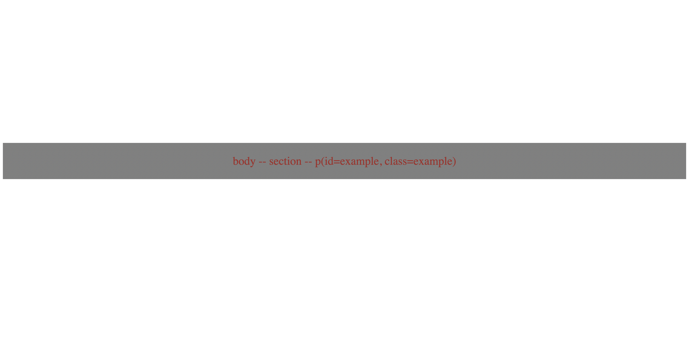

# Specificity

## Description

In CSS, specificity is a way to determine which style rule should be applied to an element when there are conflicting styles. Specificity is calculated based on a point system. The higher the specificity score, the higher the priority given to that style rule.

Let's analyze the HTML and CSS provided:

```html
<section>
  <p id="example" class="example"> A Paragraph </p>
</section>
```

```css
section {
  color: red;
}

* {
  color: blue;
}

p {
  color: green;
}

.example {
  color: orange;
}

#example {
  color: purple;
}
```

We have a paragraph element with an ID "example" and a class "example". Now let's calculate the specificity score for each style rule:

- section:
  - Specificity: 0,0,0,1 (1 element)
  - Color: red

- \*:
  - Specificity: 0,0,0,0 (0 elements, universal selector)
  - Color: blue

- p:
  - Specificity: 0,0,0,1 (1 element)
  - Color: green

- .example:
  - Specificity: 0,0,1,0 (1 class)
  - Color: orange

- #example:
  - Specificity: 0,1,0,0 (1 ID)
  - Color: purple

Now, let's compare the specificity scores:

- #example (0,1,0,0) has the highest specificity score.
- .example (0,0,1,0) comes next.
- section (0,0,0,1) and p (0,0,0,1) have the same specificity score, but since p is declared later in the CSS, it will override the section style.
- The * selector (0,0,0,0) has the lowest specificity score.
- Based on the specificity scores, the style rule with the ID selector #example has the highest specificity, and therefore, the paragraph text will be styled with the color purple.


- index-v1.html

