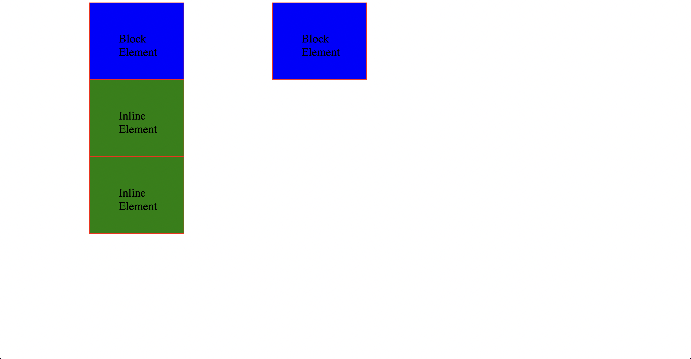

# Inline Block Display

- In the given code, you have two types of elements: 
 and . By default, 
 elements have a block-level display, while  elements have an inline display.

- When an element has a block-level display, it occupies the entire width of its parent container, creating a new line both before and after the element. The 
 elements in your example have a default display of block, so they will take up the full width and stack vertically.

- On the other hand, inline elements, like the  in your example, only take up the space required by their content and do not force new lines before or after them. As a result, inline elements can be placed next to each other horizontally.

- In summary, by using display: inline-block; for 
 elements and display: block; for  elements, you effectively swap their default display behavior, making 
 elements behave more like inline elements and  elements behave more like block elements.
  

- index-v1.html

