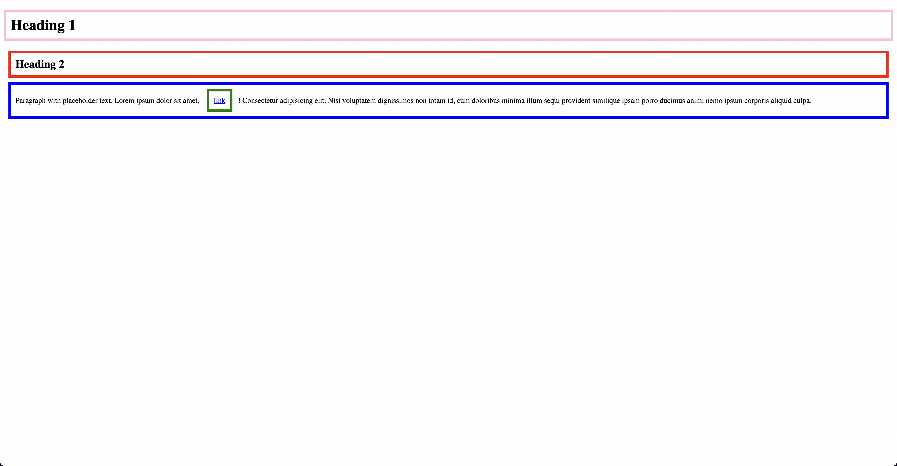

# Box Model

## Explaination 1

In the provided code, the box model refers to how the browser calculates the 
total width and height of an element, considering its content, padding, border, and margin. 
Debugging the box model helps you understand how the dimensions of an element are calculated, 
and how it interacts with other elements on the page.


To debug the box model using browser developer tools, follow these steps:

- Open the HTML file in your browser.
- Right-click on the element you want to inspect (in this case, the \<h1\> element) 
  and select "Inspect" or "Inspect Element" from the context menu. 
  This will open the browser's developer tools, and the Elements (or HTML) panel should be visible.
- In the Elements panel, you will see the HTML structure of the page. 
  The selected element (\<h1\>) will be highlighted.
- In the Styles panel (usually located to the right or below the Elements panel), 
  you will see the CSS applied to the selected element. 
  In this case, you will see the padding and border styles applied to the \<h1\> element.


```css
h1 {
  padding: 10px;
  border: 5px solid pink;
}
```

- Below the Styles panel, you should find the "Box Model" or "Layout" panel, 
  which visually represents the box model of the selected element. This panel shows 
  the content area (width and height), padding, border, and margin of the element. 
  In this example, the content area of the \<h1\> element is determined by 
    - the text "Heading 1", 
    - the padding is set to 10px, and 
    - the border is set to 5px solid pink. 
  The margin is not set in the provided code, so it will use the browser's default value.


## Explaination 2

The box model is a fundamental concept in CSS that describes the layout of elements on a webpage. 
It defines how elements like padding, borders, and margins affect the overall dimensions of an element.

In the provided code, the \<h1\> element has a specified padding and border. 
Let's examine how the box model applies to this element:

- Content: The actual text inside the \<h1\> element, in this case, "Heading 1". 
  The content has a width and height based on the size of the text and the font being used.
- Padding: The space between the content and the border. In this example, 
  the padding is set to 10px all around the content. This padding creates a 
  10-pixel space between the text and the border.
- Border: The line that surrounds the content and padding. In this example, 
  the border is set to be 5px wide and solid pink. The border is drawn 
  around the padding and content, adding to the overall size of the element.
- Margin: The space outside the border that separates the element from other elements. 
  In this example, no margin is specified, so the browser's default margin for \<h1\> elements 
  will be applied.

When you render this HTML code in a browser, you'll see that the \<h1\> element has a pink 
border and padding around the text. The box model determines the overall dimensions of the \<h1\> element, 
which include the content, padding, and border.

- index-v1.html

