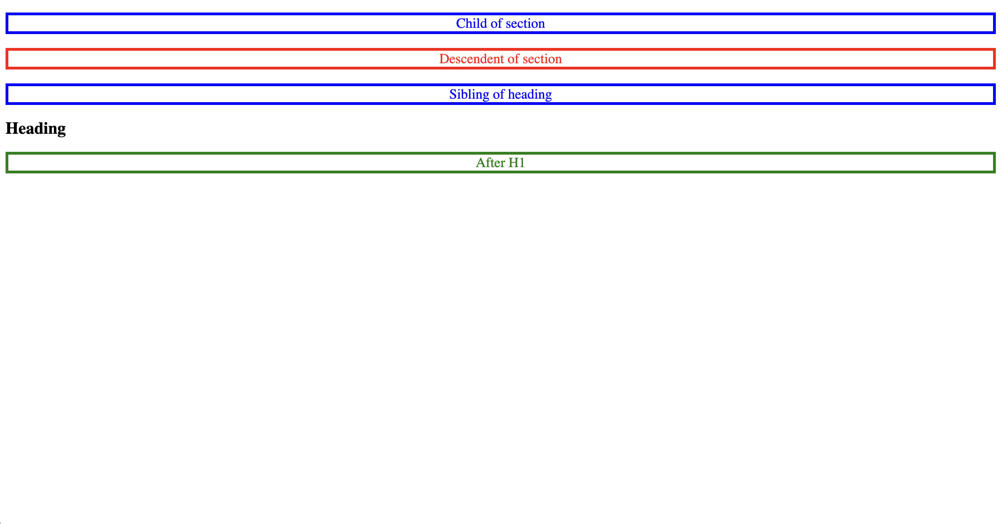

# Relational Selectors Combinators

- This code demonstrates the use of different CSS relational selectors or combinators to style elements based on their relationships to other elements in the HTML structure.


Explanation of CSS relational selectors or combinators used:

- p: This selector targets all \<p\> elements and sets the font-size property to 20px.
  
```css
p {
  font-size: 20px;
}
```

- section p: This selector targets all \<p\> elements that are descendants of a \<section\> element, regardless of the nesting level, and sets the color property to red.

```css
section p {
  color: red;
}
```

- section > p: This selector targets all \<p\> elements that are direct children of a \<section\> element and sets the color property to blue.

```css
section > p {
  color: blue;
}
```


- h1 + p: This selector targets any <p> element that immediately follows an <h1> element, and sets the color property to pink.

```css
h1 + p {
  color: pink;
}
```

- h1 ~ p: This selector targets any <p> element that is a sibling of an <h1> element, regardless of their positions, and sets the color property to green.

```css
h1 ~ p {
  color: green;
}
```

The resulting colors for the paragraphs will be:

- "Child of section": Blue (child of section and descendant of section, blue overrides red)
- "Descendent of section": Red (descendant of section)
- "Sibling of heading": Blue (child of section and descendant of section, blue overrides red)
- "After H1": Green (sibling of heading, green is applied since it comes after the pink color in the code)
- The "Heading" text, which is inside the <h1> element, will be displayed in black, as there is no specific styling applied to it in the CSS code provided.


- index-v1.html


