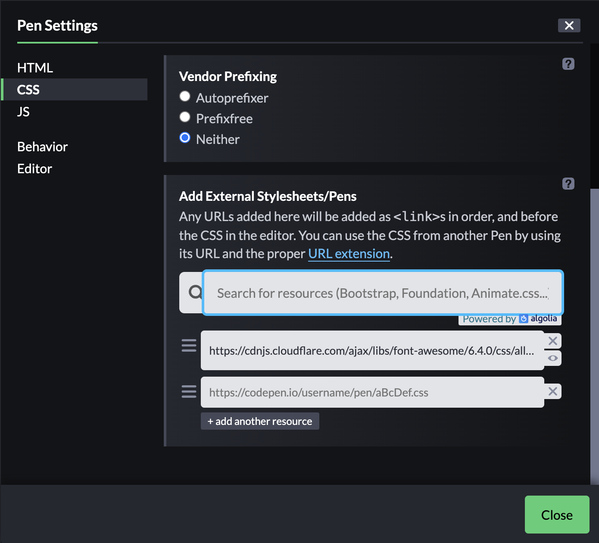

# Font-awesome icons

- You will need to choose the icon from the website [https://fontawesome.com](https://fontawesome.com) 
- For linkedIn [https://fontawesome.com/icons/linkedin?f=brands&s=solid](https://fontawesome.com/icons/linkedin?f=brands&s=solid)
- Find the html code for the icon

```html
<i class="fa-brands fa-linkedin"></i>
<!-- You can also use span -->
<span class="fa-brands fa-linkedin"></span>
```


- Include the corresponding CDN URL in the `head` section of html
- Found the URL for CDN using [codepen](https://codepen.io) settings section, but there should be a better way.
  


```html
        <link href="https://cdnjs.cloudflare.com/ajax/libs/font-awesome/6.4.0/css/all.min.css" rel="stylesheet">
```


