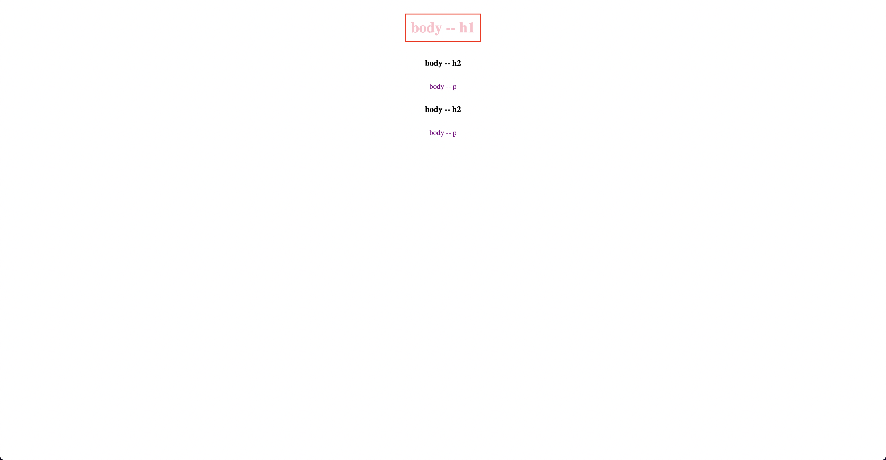

# Type and Universal selectors

- `*` - This is the universal selector, which matches any element. The rule color: red; sets the text color of all elements on the page to red.
- `h1` - This selector targets all h1 elements on the page and sets their text color to blue.
- `h2` - This selector targets all h2 elements on the page and sets their text color to green.

These selectors use element selectors to target specific HTML elements. The * selector selects all elements, while the h1 and h2 selectors target only h1 and h2 elements, respectively.

- index-v1.html

