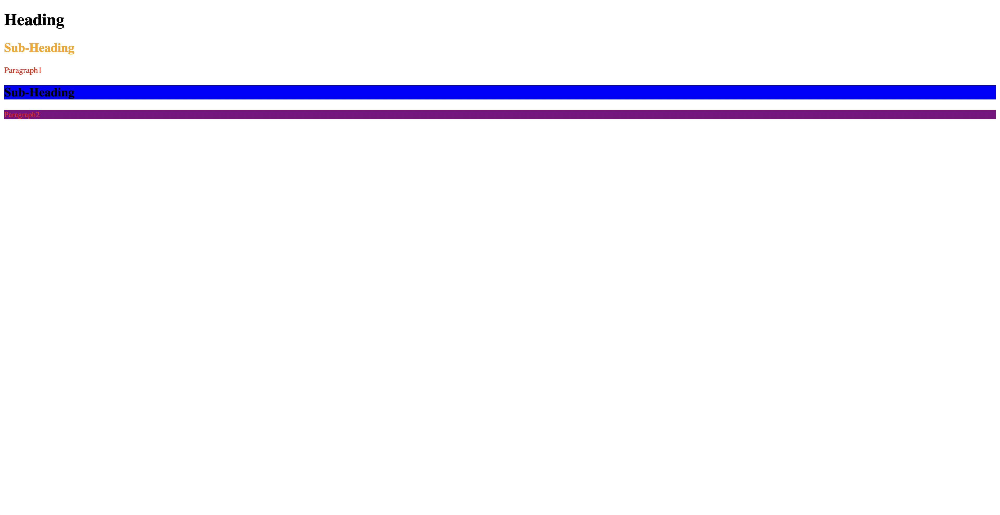
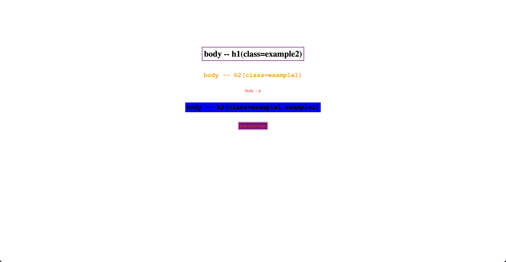

# Class And ID Selectors

- The `.example2` selector is used to apply the style color: black to all elements with a class of "example2".

- The `.example1.example2` selector is used to apply the style background: blue to all elements with both "example1" and "example2" classes.

- The `#iamp` selector is used to apply several styles to the element with ID "iamp". These styles include font-size: 15px, border: green, and background: purple

- index-v1.html

