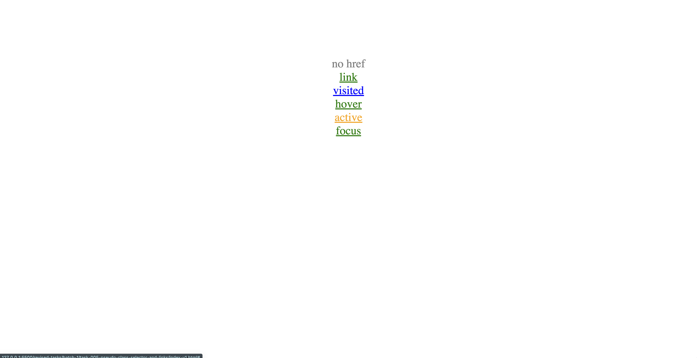

# Pseudo Class Selector and Links

In the provided example, there are several anchor elements (<a>) with different states, represented by CSS pseudo-class selectors. Pseudo-class selectors are used to style an element when it's in a specific state or matches a certain condition. In this case, the pseudo-classes are used to style the different states of the anchor elements.

Here's an explanation of the pseudo-class selectors used in the example:

- a: This is a simple element selector that targets all anchor elements (<a>). The style rule sets the color of the text in the anchor elements to red by default.

```css
a {
    color: red;
}
```

- a:visited: This is a pseudo-class selector that targets anchor elements that have been visited (clicked on) by the user. The style rule sets the color of the visited links to green.

```css
a:visited {
    color: green;
}
```

- a:focus: This is a pseudo-class selector that targets anchor elements when they have focus. An element receives focus when it is selected using the keyboard (e.g., by pressing the 'Tab' key) or clicked on. The style rule sets the color of the focused links to orange.

```css
a:focus {
    color: orange;
}
```

- a:hover: This is a pseudo-class selector that targets anchor elements when the mouse pointer is hovering over them. The style rule sets the color of the hovered links to blue.

```css
a:hover {
    color: blue;
}
```

- a:active: This is a pseudo-class selector that targets anchor elements when they are being activated (e.g., when the user clicks on them or presses 'Enter' on a focused link). The style rule sets the color of the active links to purple

```css
a:active {
    color: purple;
}
```


- index-v1.html

