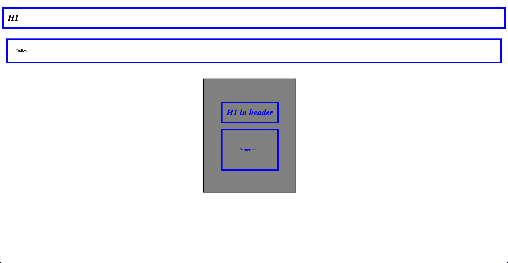

# Font Weight and Font Style

font-weight: This property is used to set the weight (thickness) of the font for the text content of an element. Common values include normal, bold, and numeric values like 100, 200, 300, ..., 900. In this example, the font-weight property is applied to the \<header\> and the \<header\>'s \<h1\>:

```css
header {
    font-weight: bold;
}

header h1 {
    font-weight: normal;
}
```

- The font-weight: bold; property applied to the \<header\> makes all text inside the header bold, including the \<h1\> and \<p\> elements. However, the font-weight: normal; property applied specifically to the \<header\>'s \<h1\> overrides the header's font-weight property and sets the font weight of the header's \<h1\> to normal.

- font-style: This property is used to set the style of the font for the text content of an element. Common values include normal, italic, and oblique. In this example, the font-style property is applied to the \<header\> and the \<i\> element:

```css
/* Uncomment the desired font-style for the header */
/* header {
    font-style: italic;
} */

/* header {
    font-style: oblique;
} */

i {
    font-style: normal;
}
```

- In the provided code, the font-style property for the \<header\> element is commented out. If you uncomment one of the options (either italic or oblique), it will apply the selected font style to all text inside the header, including the \<h1\> and \<p\> elements.

- The font-style: normal; property applied to the \<i\> element overrides the default italic style of the \<i\> element, making the text inside the \<i\> element appear with normal (non-italic) font style. To keep the text inside the \<i\> element italic, you can comment out or remove the font-style: normal; property from the i rule.


- index-v1.html

