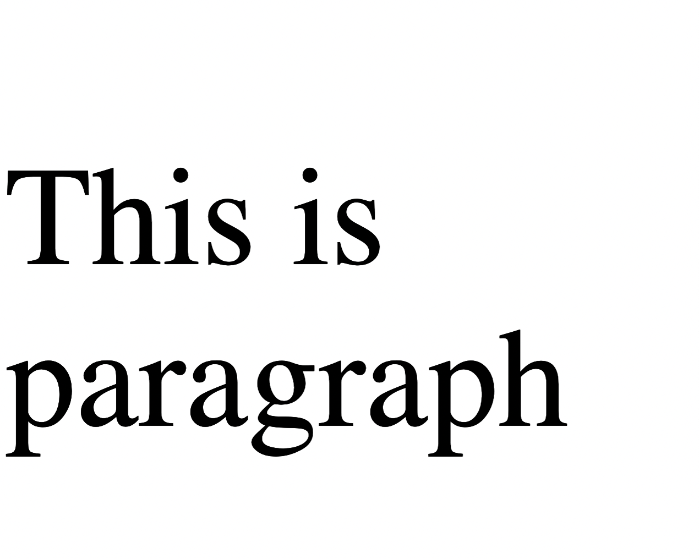
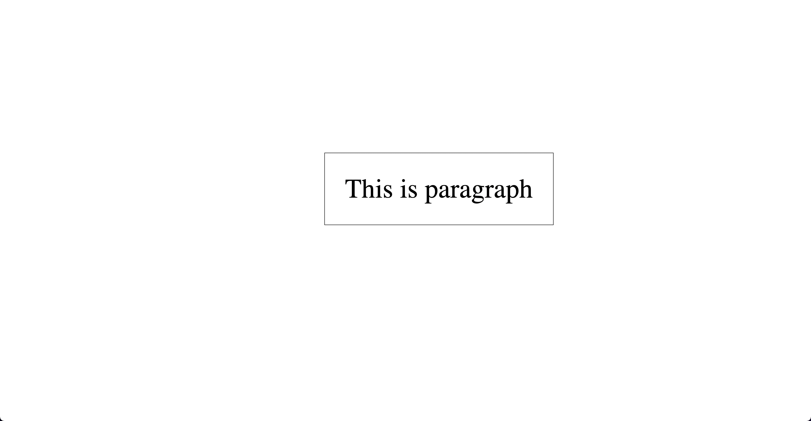

# Font Size

The font-size property in CSS is used to define the size of the font for text content in elements. In this code, the font-size property is applied to the html, .parent, and .child elements:

- The html element's font-size is set to 2rem. rem stands for "root em" and is relative to the root element's font size (by default, 1rem is equal to the browser's default font size, typically 16px). In this case, 2rem sets the font size of the html element to twice the browser's default font size.

- The .parent element's font-size is commented out. If uncommented, it would set the font size of the .parent element to 2em. em is relative to the font size of the element's parent. In this case, it would be twice the font size of the html element (which is 2rem).

- The .child element's font-size is set to 4em. This is relative to the font size of the .parent element. Since the .parent element doesn't have a font-size explicitly set, it inherits the html element's font-size of 2rem. Thus, the .child element's font-size will be 4 times the html element's font-size, resulting in 8rem.

In summary, the font-size property is used to control the size of the font for the text content of elements. In this example, the html, .parent, and .child elements have their font sizes set using different units (rem and em) to create a hierarchy of font sizes.

- index-v1.html

