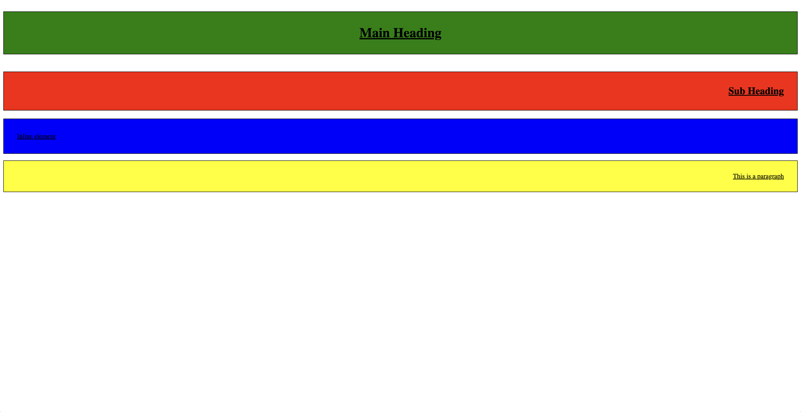

# Text Decoration, Text Align And Line Height

- text-decoration: it can be used to apply various text decorations like underline, overline, line-through, and none to the text content of an element. For example, text-decoration: underline; would add an underline to the text.

- text-align: This property sets the horizontal alignment of text within an element. In the provided code, the text-align property is applied to the \<header\> and \<h1\> elements. The different text-align values in the \<header\> rule are commented out, and if one of them is uncommented, it will set the alignment for all text within the \<header\>:

```css
header {
    /* Uncomment one of the following lines to set text alignment for the header */
    /* text-align: center; */
    /* text-align: right; */
    /* text-align: left; */
    /* text-align: justify; */
}
```

- The \<h1\> element has its text-align property set to center, which means the text within the \<h1\> will be horizontally centered within the element:

```css
h1 {
    text-align: center;
    background-color: green;
}
```

- line-height: This property sets the height of a line of text in an element. It can be defined using different units, like pixels (px), points (pt), or relative units (em, rem). In the provided code, the line-height property is applied to the \<p\> element:


- In summary, text-decoration, text-align, and line-height are CSS properties used to control the appearance and layout of text within elements.


- index-v1.html

