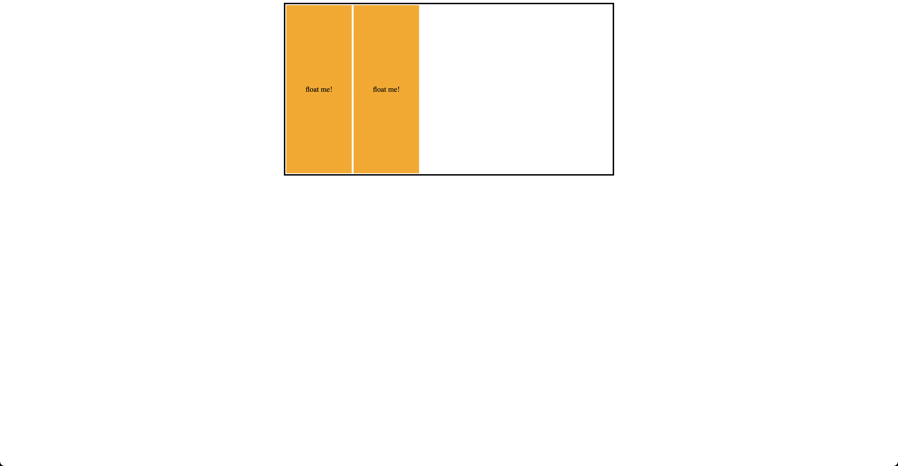

# Float and collapsed content

- In this example, the code demonstrates how to use the clearfix technique to clear floated elements inside a container, preventing the container from collapsing.

- .clearfix:after: This is a "clearfix" hack that uses a pseudo-element to clear floated elements. The :after pseudo-element creates an invisible element after the container element with the content set to an empty string. The display: table; and clear: both; properties ensure that this invisible element clears the floats.

- .container: This class defines the container with a border, width, and centered alignment using margin: 0 auto;.

- .float: This class defines the properties of the floating elements, including background color, border, dimensions, padding, and the float: left; property that makes them float to the left.

- In the HTML structure, two div elements with the class .float are placed inside a div container with the class .container. The container also has the clearfix class applied, which clears the floats and prevents the container from collapsing. As a result, the floating elements are positioned side by side within the container, which retains its dimensions and properly encloses the floated elements.

What do you mean here by collapsing?

- "Collapsing" in this context refers to the behavior of a container element when it contains floated elements. If the floated elements inside the container are not properly cleared, the container might not fully enclose or expand to contain the floated elements, causing it to appear as if its height has "collapsed" or become too short.

- index-v1.html

