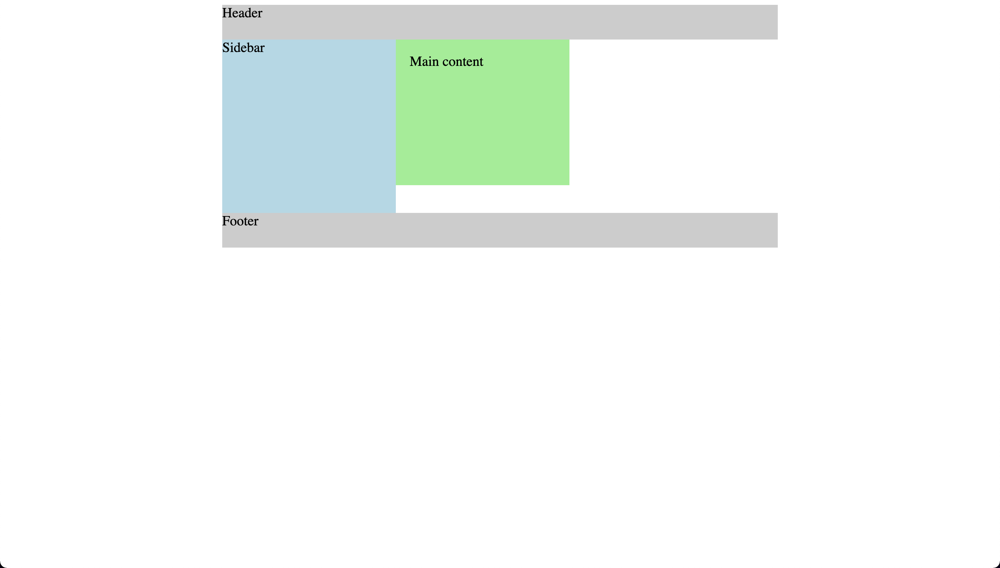

# Layout and box model

- In this code, a simple HTML layout is defined with a header, sidebar, main content area, and a footer. The CSS properties are applied to create the desired layout and styles.

- html { box-sizing: border-box; }: Sets the box-sizing property for the HTML element to border-box. This means the padding and border are included within the element's total width and height.
- *, *:before, *:after { box-sizing: inherit; }: Ensures that all elements, their before and after pseudo-elements, inherit the box-sizing property from their parent elements.
- .wrapper: The wrapper class is applied to the container that holds all other elements. It sets the font size to 20px, the width to 800px, and centers the container with margin: 0 auto;.
- header, footer: Both header and footer elements share the same background color and height.
- aside: The sidebar element has a light blue background, a fixed width, and height, and it's floated to the left.
- article: The main content area has a light green background, a fixed width and height, and 20px padding around the content. It is also floated to the left, which positions it beside the sidebar.
- footer { clear: both; }: The clear: both; property applied to the footer ensures that it is positioned below both the sidebar and main content, regardless of their heights.

The resulting layout will display a header at the top, a sidebar and main content area positioned side by side, and a footer below both the sidebar and main content area.

- index-v1.html

