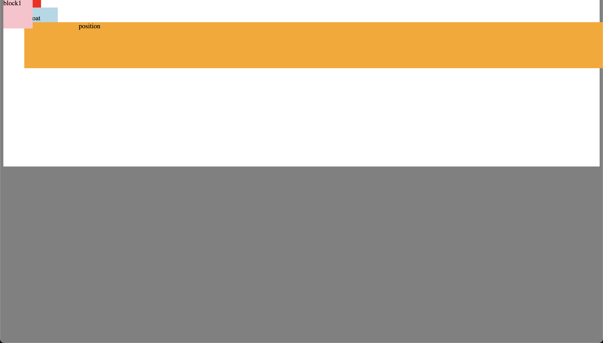
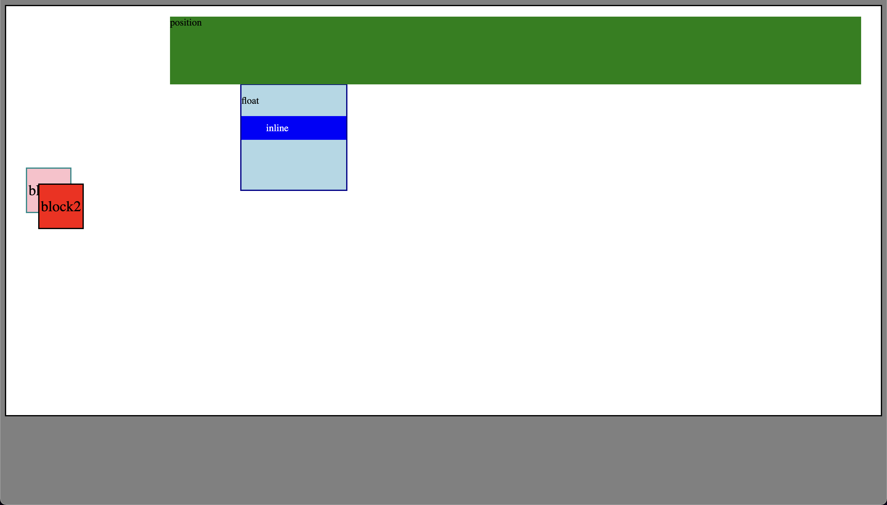

# Position and Z Index

- In this code, you have several elements with different positions, and one of them has a z-index property. Here's an explanation of the positions and z-index in this code:

- .block1: Positioned absolutely, which means it is placed relative to the nearest positioned ancestor (in this case, the body). The top-left corner of the .block1 div is aligned with the top-left corner of the body.
- .block2: Positioned statically (default position). The negative margin causes it to overlap .block1.
- float: Floated left, which means it is taken out of the normal document flow and placed to the left of the parent container. It has a negative margin that makes it overlap .block2.
- .inline: Positioned inline, which means it stays within the normal flow of the document.
- .position: Positioned relatively, which means it is offset from its normal position in the document flow by the left and top properties.

Z-index:

- .block1 has a z-index of 200, which means it will appear above other elements with a lower z-index or no z-index specified. In this case, it appears above .block2 and .float, even though they overlap with .block1.

The resulting layout has overlapping elements, with .block1 appearing above the others due to its z-index value. The other elements will be stacked in the order they appear in the document, with later elements appearing above earlier ones when they overlap.

- index-v1.html

