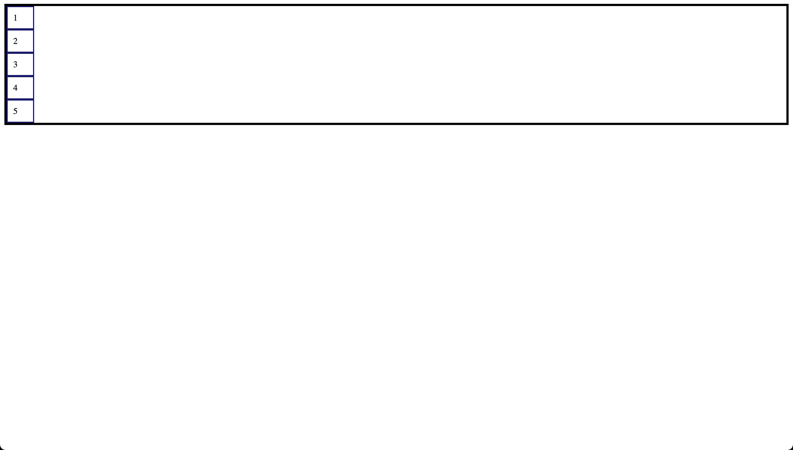
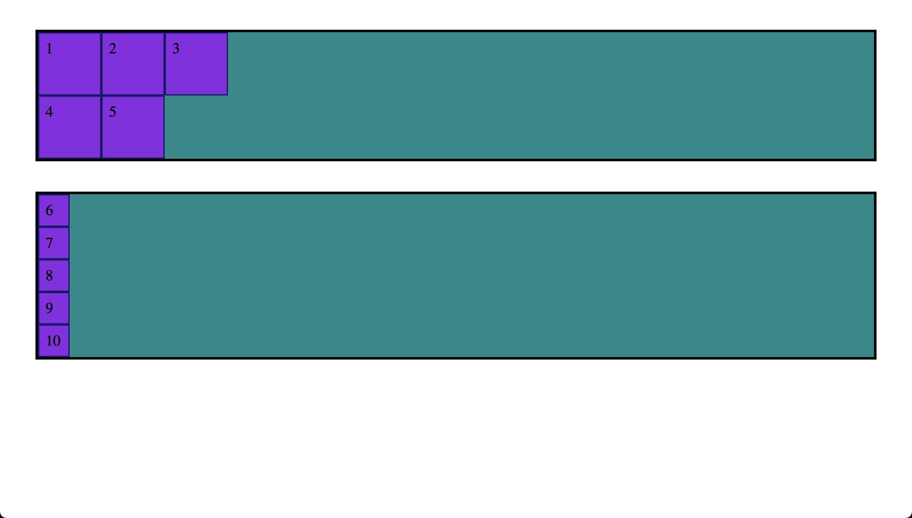

# Explicit Grid

- This code demonstrates the use of CSS Grid layout to create a grid container with child elements. Here's an explanation of the code:

HTML structure:

- There is a .grid-container div that acts as a container for five .grid-item divs.
- Each .grid-item div contains a single number.

CSS:

- .grid-container: This class adds a border and sets the container's display property to grid. The grid-auto-columns: 50px; property specifies the size of automatically generated columns in the grid. In this case, the width of each auto-generated column is 50px.
- .grid-item: This class applies a border and padding to each child element.

- The resulting layout is a grid container with 5 child elements that are placed into auto-generated columns with a width of 50px. Since the grid-template-columns and grid-template-rows properties are commented out, the grid will automatically create columns and rows as needed to fit the child elements.
- Note that if you uncomment the grid-template-columns and grid-template-rows properties, you'll create a grid with fixed column and row sizes, and the grid-auto-columns property will no longer apply. The grid-auto-rows property, when uncommented, will set the height of auto-generated rows to 200px.

- index-v1.html

