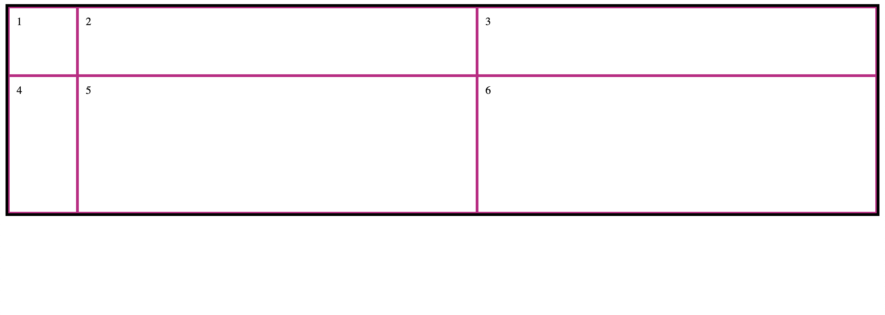
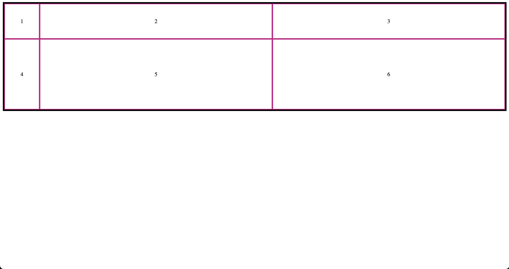

# Implicit Grid

- This code demonstrates an implicit grid layout using CSS Grid. The difference between an explicit and implicit grid is that an explicit grid has explicitly defined rows and columns using the grid-template-rows and grid-template-columns properties, while an implicit grid creates rows and columns automatically to accommodate extra grid items not explicitly placed.


Here's an explanation of the code:

HTML structure:

- There is a .grid-container div that acts as a container for three .grid-item divs.
Each .grid-item div contains a single number.

CSS:

- .grid-container: This class adds a border and sets the container's display property to grid. The grid-template-columns property is set to 100px repeat(2, 1fr), which creates three columns: one with a width of 100px and two with equal widths that share the remaining space. The grid-template-rows property is set to 100px, creating a single row with a height of 100px. The grid-auto-rows property specifies the height of automatically generated rows, which is 200px in this case.
- .grid-item: This class applies a border and padding to each child element.

The resulting layout is a grid container with 3 child elements placed into an explicit grid with the specified rows and columns. The implicit grid comes into play when you uncomment the additional .grid-item divs (4, 5, and 6). Since the explicit grid has only one row, the extra grid items will be placed in implicitly created rows with a height of 200px, as specified by the grid-auto-rows property.


Uncommenting the additional items



how do i know whether it is explicit or implicit?

- To determine whether a grid is explicit or implicit, you need to analyze the CSS properties used in the .grid-container class.
  
Explicit grid:

- An explicit grid is created when you explicitly define the rows and columns using the grid-template-rows and grid-template-columns properties. If these properties are present, the grid is explicitly defined.

```css
.grid-container {
  display: grid;
  grid-template-columns: 100px 200px;
  grid-template-rows: 150px 150px;
}
```

Implicit grid:

- An implicit grid is created when you have more grid items than the explicitly defined grid can accommodate. In this case, the browser will automatically create additional rows or columns to fit the extra grid items. The grid-auto-rows and grid-auto-columns properties control the size of these implicitly created rows and columns

```css
.grid-container {
  display: grid;
  grid-template-columns: 100px 200px;
  grid-auto-rows: 150px;
}
```

- To summarize, if you see grid-template-rows and/or grid-template-columns properties in the .grid-container class, you are dealing with an explicit grid. However, if there are more grid items than the explicitly defined grid can accommodate, the browser will create an implicit grid using the grid-auto-rows and grid-auto-columns properties.

- index-v1.html


