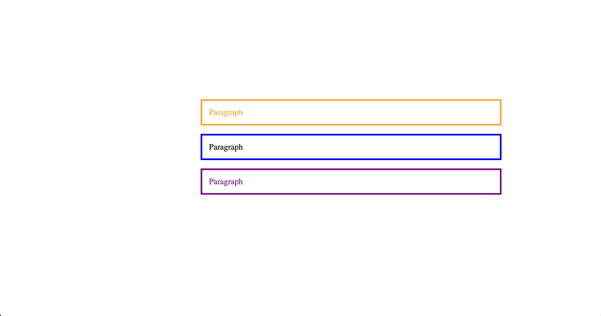

# Pseudo Class Selectors

Pseudo-class selectors are a special type of selectors in CSS that allow you to apply styles based on the state or position of an element within the document, without having to add classes or IDs to the element. Pseudo-class selectors are preceded by a colon (:).


Now let's break down the CSS code and explain each selector:

- p: This selector targets all \<p\> elements and sets the font-size property to 20px.

```css
p {
  font-size: 20px;
}
```

- p:first-child: This selector targets any \<p\> element that is the first child of its parent element and sets the color property to red. In the provided HTML, this selector will target the first \<p\> element within the \<section\>.

```css
p:first-child {
  color: red;
}
```

- p:last-child: This selector targets any \<p\> element that is the last child of its parent element and sets the color property to green. In the provided HTML, this selector will target the last \<p\> element within the \<section\>.

```css
p:last-child {
  color: green;
}
```

- p:first-of-type: This selector targets the first \<p\> element of its parent element, among the elements of the same type, and sets the color property to orange. In the provided HTML, this selector will target the first \<p\> element within the \<section\>. In this example, it has the same effect as p:first-child.

```css
p:first-of-type {
  color: orange;
}
```

- p:last-of-type: This selector targets the last \<p\> element of its parent element, among the elements of the same type, and sets the color property to purple. In the provided HTML, this selector will target the last \<p\> element within the \<section\>. In this example, it has the same effect as p:last-child.

```css
p:last-of-type {
  color: purple;
}
```


- index-v1.html

