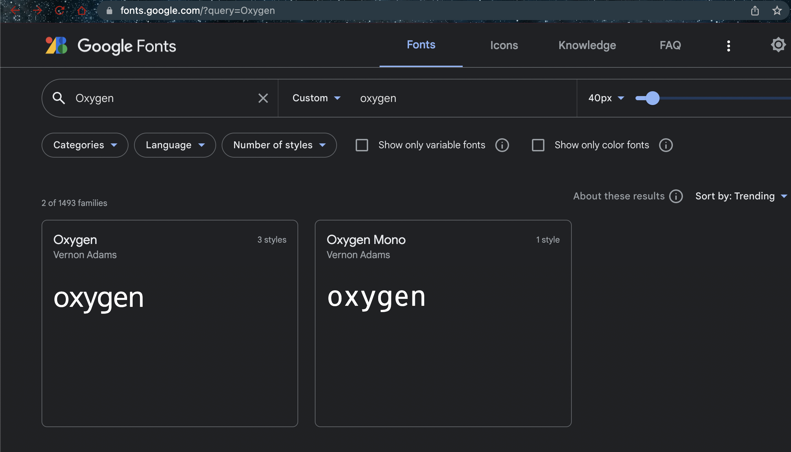
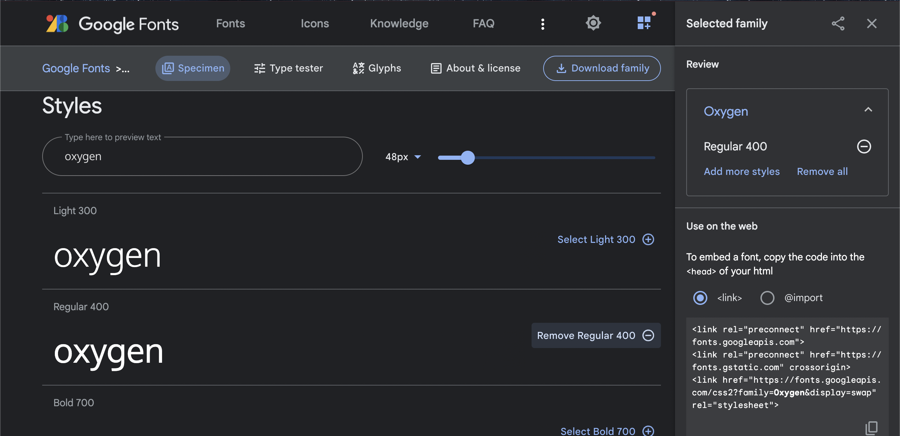

# Variables and Styling Setup


- The fonts are imported from Google Fonts (fonts.google.com) using the following HTML links:





```css
   <link rel="preconnect" href="https://fonts.googleapis.com">
   <link rel="preconnect" href="https://fonts.gstatic.com" crossorigin>
   <link href="https://fonts.googleapis.com/css2?family=Oxygen&family=Oxygen+Mono&display=swap" rel="stylesheet">
```

```css
:root {
    --black: #171321;
    --dkblue: #0d314b;
    --plum: #4b0d49;
    --hotmag: #ff17e4;
    --magenta: #e310cb;
    --aqua: #86fbfb;
    --white: #f7f8fa;
    --font-size: 1.3rem;
    --mono: "Oxygen mono", monospace;
    --sans: Oxygen, sans-serif;
}
```

- `:root`: 
  - The `:root` selector targets the highest-level parent element in the DOM (Document Object Model), which is usually the `<html>` element Custom properties defined in the `:root` selector have global scope, meaning they can be accessed and used by any element in the CSS code.

  - The lines inside the curly braces {} define custom properties with their respective values:

  - In the given code snippet,
  - `--black` is a CSS custom property (also known as a CSS variable) that is used to store a specific color value. In this case, `--black` is assigned the color value #171321, which is a dark shade of black.


## border box model

```css
html {
    box-sizing: border-box;
}
```

[https://css-tricks.com/box-sizing](https://css-tricks.com/box-sizing) 

## box-sizing: border-box

This is the style property and its value. The box-sizing property defines how the width and 
height of an element are calculated. By setting the value to border-box,
the width and height of an element will include the padding and border,
but `NOT` the margin. This can make it easier to create consistent layouts,
as adding padding or borders won't change the overall size of the element

Padding: 

Padding is the space between the content (like text or images) inside an element and its border. 
It is used to create some breathing room around the content, making it visually more appealing and easier to read. 
Padding is part of the element's box, which means it affects the element' s width and height when the 
box-sizing property is set to border-box. You can set padding for all four sides of an 
element (top, right, bottom, and left) individually or all at once using the padding property.

Border

The border is a line or a set of lines that surround an element,
enclosing its content and padding. It visually separates the element from other 
elements and can enhance the overall design of a web page. The border can be styled in various ways,
such as thickness,color,
and style (solid, dashed, dotted, etc.).

Margin

Margin is the space around the outside of an element's border. 
It creates space between the element and its neighboring elements, 
helping to separate and position them within a layout. Margin is not part of the element' s box,
and it does not affect the element's width and height. 
You can set margin for all four sides of an element (top, right, bottom, and left) 
individually or all at once using the margin property.

## before, after

```css
*,
*::before,
*::after {
    box-sizing: inherit;
}
```

- `*,*::before,*::after`:                These are the selectors.

  - `*`: The asterisk (*) is a universal selector, which targets all elements on the page. 

 - `*::before`: This targets the ::before pseudo-elements of all elements on the page. 
   ::before pseudo-elements are used to insert content before an element's actual content.

 - `*::after`: This targets the ::after pseudo-elements of all elements on the page. 
  ::after pseudo-elements are used to insert content after an element's actual content.

- The curly braces encapsulate the style properties and their values 
that will be applied to the targeted elements.

- The box-sizing property defines how the width and height of an element are calculated.

- The inherit value means that the targeted elements will inherit the box-sizing 
property value from their parent element. This is useful when you want all 
elements to use the same box-sizing value consistently throughout the document.


## Body

```css
body {
  padding: 0;
  margin: 0;
  font-family: var(--sans);
  background-color: var(--black);
  /*
  The following is the color of the text
  */
  color: var(--white);
  font-size: var(--font-size);
}
```

- padding: 0;: This sets the padding around the content of the `<body>` element to zero, so there is no space between the content and the edges of the `<body>` element.
- font-family: var(--sans);: This sets the font family for the text in the `<body>` element to the value of the custom property --sans. The --sans custom property is defined in the :root selector and has the value Oxygen, sans-serif, which means that the browser will use the Oxygen font if available, otherwise falling back to the default sans-serif font.
- background-color: var(--black);: This sets the background color of the `<body>` element to the value of the custom property --black, which is #171321 (a dark color).
- color: var(--white);: This sets the text color of the `<body>` element to the value of the custom property --white, which is #f7f8fa (a light color)
- font-size: var(--font-size);: This sets the font size of the text in the `<body>` element to the value of the custom property --font-size, which is 1.3rem. The rem unit is relative to the root element's font size (usually the `<html>` element), so this font size will be 1.3 times the root element's font size.


- index-v1.html


