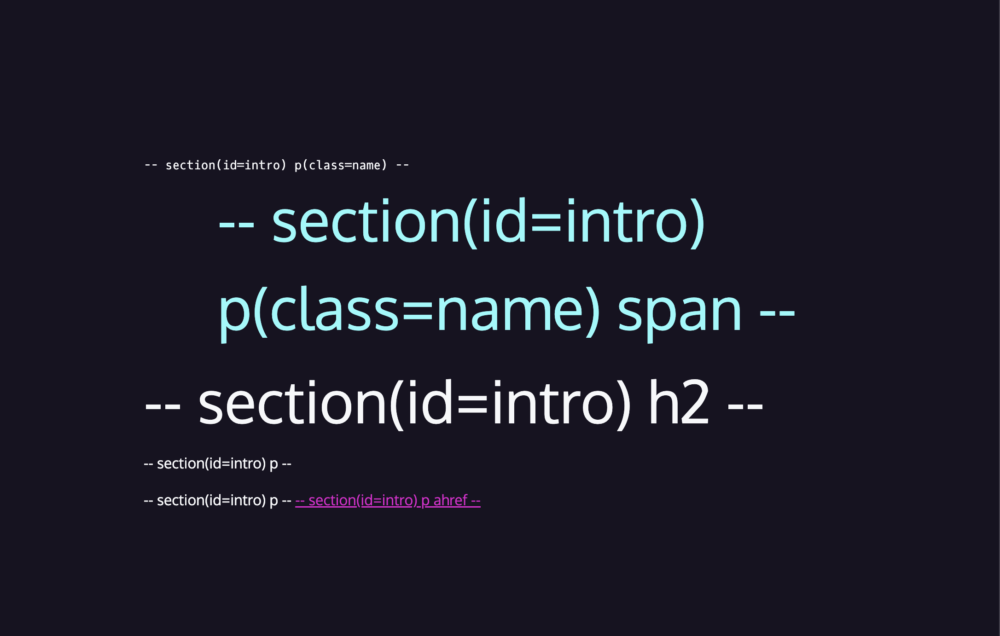

# Style the html

- The intro section of the CSS is responsible for styling the elements within the `<section id="intro">` element in the HTML. Here's a breakdown of each CSS rule and its effects:

```css
/* intro styles */

#intro {
  padding-bottom: 10rem;
}

#intro p {
  font-size: 1rem;
  /* should not have any unit */
  line-height: 1.5;
}

#intro .name {
  font-family: var(--mono);
}

.name span {
  font-family: var(--sans);
  font-size: 4rem;
  color: var(--aqua);
  /* Ankit will come in new line*/
  display: block;
}

#intro h2 {
  font-size: 4rem;
  font-weight: normal;
}
```

- `#intro`: This rule targets the element with the id attribute of "intro". It sets the padding-bottom property to 10rem, adding space below the content inside the intro section.
- `#intro p`: This rule targets all `<p>` elements within the element with id "intro". It sets the font-size property to 1rem (which is equal to the font size of the root element) and the line-height property to 1.5, providing more space between lines of text in the paragraph elements.
- `#intro .name`: This rule targets elements with the class "name" within the element with id "intro". It sets the font-family property to the value of the custom property --mono, which is "Oxygen mono", monospace, causing the text to be rendered in the Oxygen Mono font if available, or a default monospace font otherwise.

- `.name span`: This rule targets `<span>` elements within elements with the class "name". It sets the font-family property to the value of the custom property --sans (Oxygen, sans-serif), the font-size property to 4rem, the color property to the value of the custom property --aqua (#86fbfb), and the display property to block. The display: block property causes the `<span>` element to behave like a block-level element, so the name "Ankit" will appear on a new line.

- `#intro h2`: This rule targets `<h2>` elements within the element with id "intro". It sets the font-size property to 4rem, making the text larger, and the font-weight property to normal, which prevents the text from being bold (the default styling for heading elements like `<h2>`).




