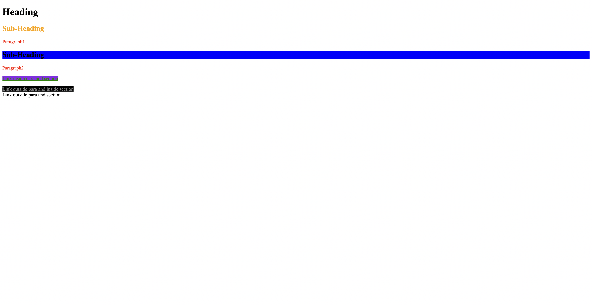
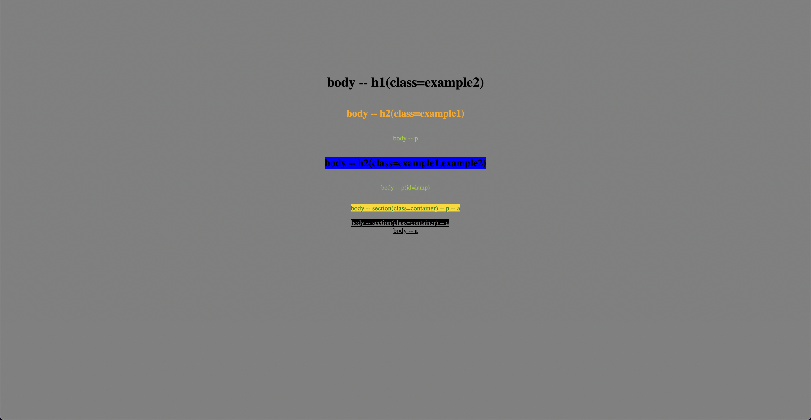

# Descendant selectors

The descendant selector in CSS is used to select an element that is a descendant of another element. It is denoted by a space between two selectors.

In the code example provided, there are several descendant selectors used:

- section a selects any a element that is a descendant of a section element. The color is set to grey.
- section p a selects any a element that is a descendant of a p element that is itself a descendant of a section element. The color is set to green.

These selectors are more specific than the a selector, so they will take precedence if the same property is defined for both.

- index-v1.html

