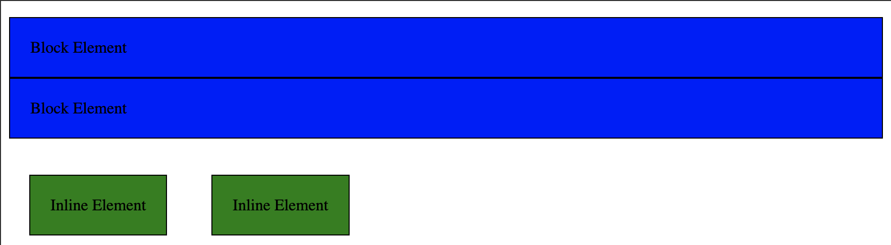
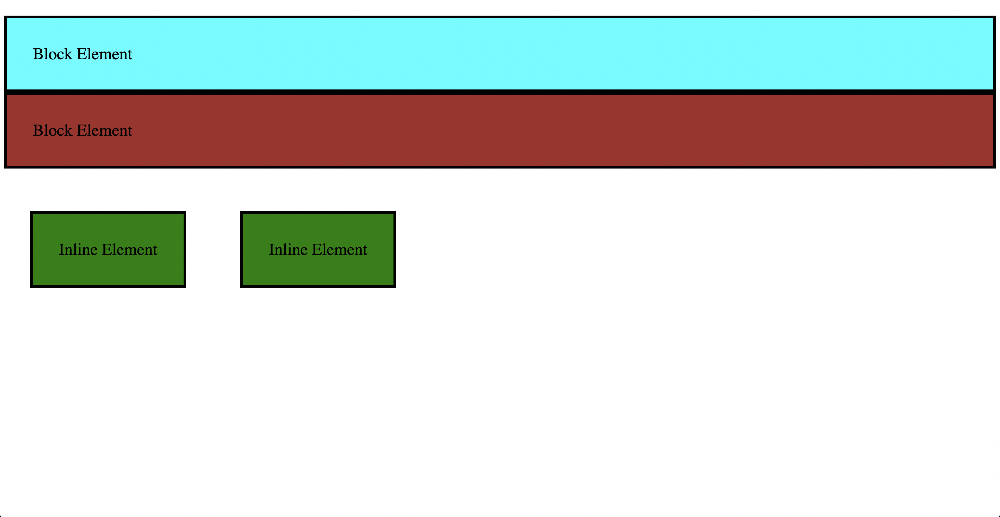

# Padding Margin Border

- In this code, you have two types of elements: <p> and <span>. The CSS is using padding, margin, and border properties to style these elements. Let's discuss each property and how they affect the elements in this example:

- padding: This property defines the space between the content of an element and its border. It is used to create space around the content inside the element's border. In this example, both <p> and <span> elements have a padding of 20px, meaning there will be a 20-pixel space between their content and border.

```css
p {
    padding: 20px;
}

span {
    padding: 20px;
}
```
- border: This property defines the border surrounding an element. It can be specified with a width, style, and color. In this example, both <p> and <span> elements have a 1px solid black border.

```css
p {
    border: 1px solid black;
}

span {
    border: 1px solid black;
}
```

- margin: This property defines the space outside an element's border, between the element and its surrounding elements. In this example, the <span> elements have a margin of 20px, meaning there will be a 20-pixel space outside their border. The <p> elements don't have a general margin property set, but the .first and .second classes are used to specifically target their top and bottom margins.

```css
span {
    margin: 20px;
}

.first {
    margin-bottom: 0;
}

.second {
    margin-top: 0;
}
```

- The .first class targets the first <p> element, setting its bottom margin to 0. The .second class targets the second <p> element, setting its top margin to 0. This effectively removes the space between these two <p> elements, making them appear as a single block with a single border between them.

- Finally, the display: inline-block; property applied to the <span> elements allows them to have block-level properties (such as setting width, height, padding, margin, and border) while still being placed next to each other horizontally.



- index-v1.html

