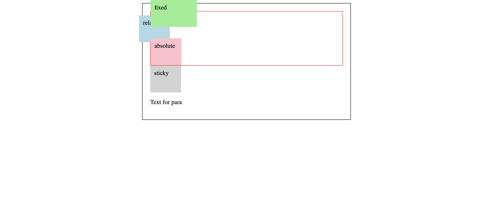
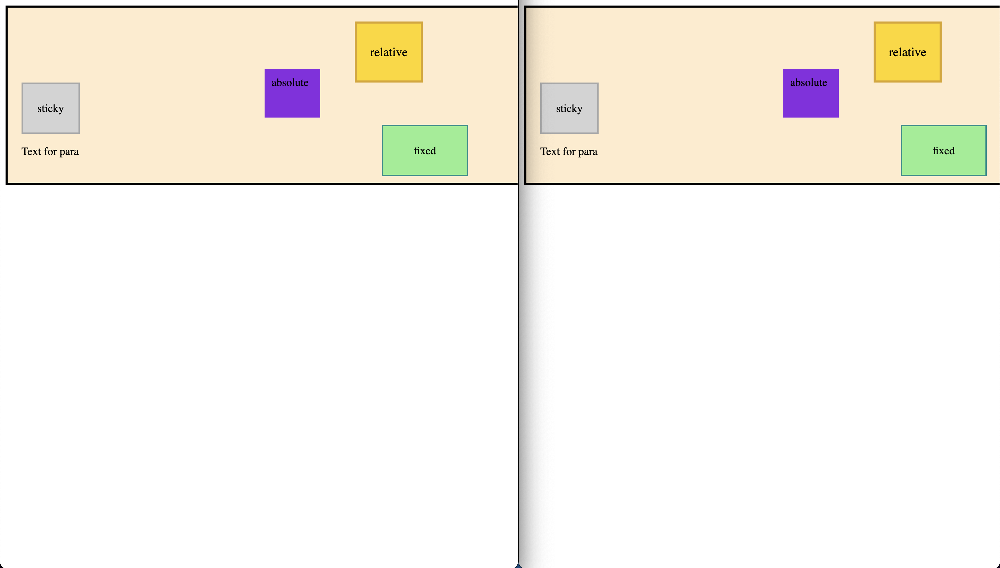
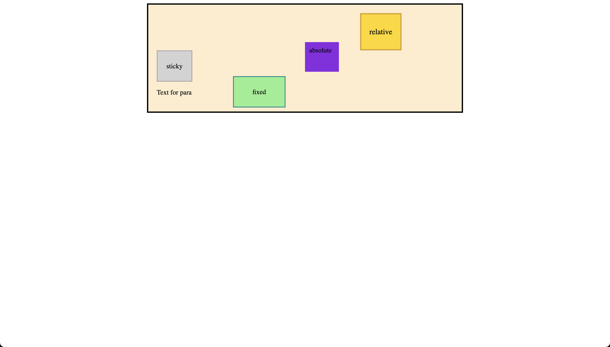

# Positions

- In this code, you have a wrapper div containing a parent div and several boxes with different positioning properties. Let me explain each positioning property and how they affect the boxes:
- relative: The relative box has a light blue background and is positioned relative to its normal position in the document flow. The top: 10px and right: 30px properties move the box 10 pixels down and 30 pixels to the left from its normal position.
- absolute: The absolute box has a pink background and is positioned relative to the nearest positioned ancestor (in this case, the wrapper). The top: 25% property places the box 25% from the top edge of the wrapper. The bottom: 5% property is ignored because the top property takes precedence.
- fixed: The fixed box has a light green background and is positioned relative to the browser window. It is 100 pixels wide and is positioned at the top (using top: 0) and bottom (using bottom: 0) of the window, creating a stretched box that remains in the same position when scrolling.
- sticky: The sticky box has a light gray background and behaves like a position: relative element until the user scrolls past a specified point (in this case, 10 pixels from the top of the viewport). After that point, it behaves like a position: fixed element and stays at the top of the viewport when scrolling.

The parent div has a red border, and the wrapper div has a black border. Each box is 60 pixels wide and 50 pixels high, except for the fixed box which is 100 pixels wide.

- index-v1.html

