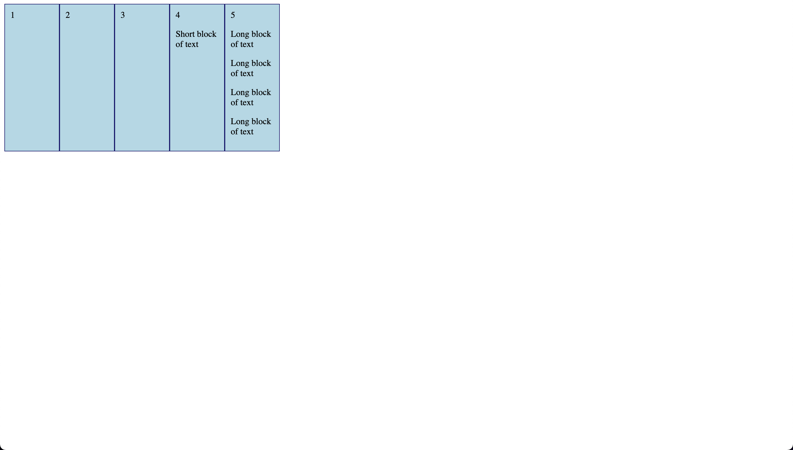
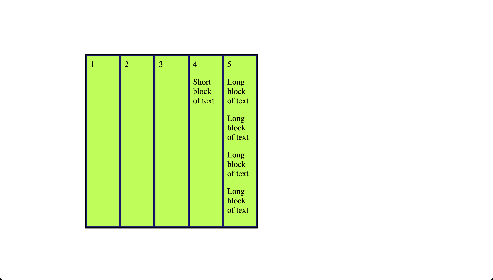

# Flex

- This code demonstrates the use of CSS Flexbox to create a responsive layout. Here's an explanation of the code:

HTML structure:

- There is a .flex-container div that acts as a container for five .flex-item divs.
- The first four .flex-item divs contain a single number, while the last two also have a paragraph element, one with a short text and the other with a longer text.

CSS:

- .flex-container: This class sets the container's background color, margin-bottom, and width. The display: flex; property is used to create a flexible container that can adjust its child elements' size and position. The flex-wrap: wrap; property allows child elements to wrap onto multiple lines if needed.
- .flex-item: This class applies a border, padding, and box-sizing to each child element. The flex: 1 1 100px; property is a shorthand for flex-grow: 1;, flex-shrink: 1;, and flex-basis: 100px;. This means that the flex items can grow and shrink to fit the container, and they have an initial size of 100px.

- index-v1.html

