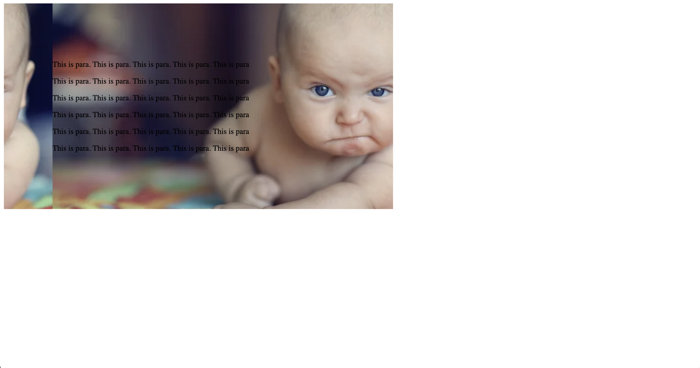

# Flexible Background Images

- This HTML code defines a simple webpage with a \<div\> element containing multiple \<p\> elements (paragraphs). The CSS code applies styles to the \<div\> with the class "background" and includes several properties related to the background.

Now let's break down the CSS code and explain each property:

- max-width: This property sets the maximum width of the element to 600 pixels.

- padding: This property adds 100 pixels of padding around the content of the element.

- background-color: This property sets the background color of the element to light blue.

- background-image: This property sets the background image of the element to a specified URL. In this case, the image is a picture of a serious baby.

- background-position: This property sets the position of the background image. In this case, it is set to 100 pixels from the left edge of the element.

- background-size: This property sets the size of the background image. In this case, it is set to 100%, which means the image will cover the entire width of the element.

- The commented-out line background-repeat: no-repeat; would disable the repetition of the background image if it were uncommented. However, since it is commented out, the background image will repeat by default.

- The resulting output will be a \<div\> element with a light blue background color, an image of a serious baby positioned 100 pixels from the left edge, and paragraphs of text inside the \<div\>. The image will cover the entire width of the \<div\> element.

 

