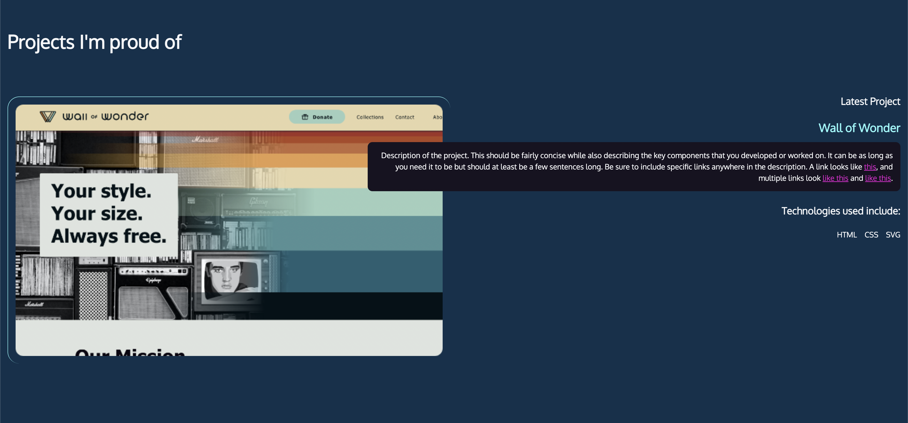

# Overlapping items with CSS Grid

- css modified

```css
@media (min-width: 550px) {
    article {
        display: grid;
        grid-template-columns: repeat(10, 1fr);
        gap: 1rem;
    }
    #projects img {
        grid-column: 1 / 6;
        grid-row: 1/2;
    }
    .text {
        grid-column: 5 / 11;
        grid-row: 1/2;
        order: 2;
        text-align: right;
    }
    #projects ul {
        justify-content: flex-end;
    }
}
```

- This CSS code snippet is using a media query to apply specific styles to elements when the minimum width of the viewport is 550 pixels or larger
  - @media (min-width: 550px) { ... }: This is a media query that will apply the styles enclosed within the curly braces only if the viewport width is at least 550 pixels.
  - article { ... }: This rule set targets all the <article> elements inside the media query. The styles will be applied as follows:
    - display: grid;: Sets the display property to 'grid', making the article element a grid container.
    - grid-template-columns: repeat(10, 1fr);: Creates a grid with 10 equal-width columns using the 'fr' unit.
    - gap: 1rem;: Sets the gap between grid items to 1 rem unit (a unit relative to the font-size of the element)
  - \#projects img { ... }: This rule set targets all  elements inside an element with the ID 'projects' and applies the following styles:
    - grid-column: 1 / 6;: The image will span from the first to the fifth grid column lines (occupying five columns).
    - grid-row: 1/2;: The image will span from the first to the second grid row lines (occupying one row).
  - .text { ... }: This rule set targets elements with the 'text' class and applies the following styles:
    - grid-column: 5 / 11;: The element will span from the fifth to the tenth grid column lines (occupying six columns).
    - grid-row: 1/2;: The element will span from the first to the second grid row lines (occupying one row).
    - order: 2;: Sets the order of the element in the grid container (useful when working with flexbox).
    - text-align: right;: Aligns the text to the right within the element.
  - \#projects ul { ... }: This rule set targets all <ul> elements inside an element with the ID 'projects' and applies the following style:
    - justify-content: flex-end;: Aligns the flex items to the end of the container (assuming the ul element is a flex container). If the ul element is not a flex container, this style will have no effect.


    - 