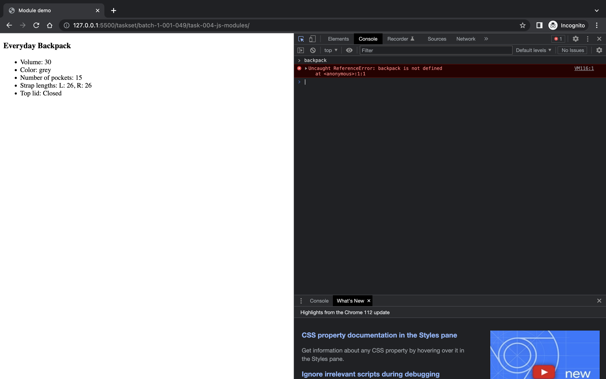

# JS modules

This code demonstrates the usage of JavaScript modules. JavaScript modules allow you to split your code into multiple files for better maintainability and reuse.

Here's how the code works:

1. `backpack.js`: This file exports a `backpack` object. The object has several properties describing a backpack and a couple of methods that manipulate the backpack. Note that `updateBackpack` is a private function that is not exported, meaning it is only accessible within `backpack.js`. The object `backpack` is exported as a default export at the end of the file.

2. `script.js`: This file imports the `backpack` object from `backpack.js` using the `import` keyword. It then creates an HTML representation of the `backpack` object and appends it to the body of the document. Note that `markup` is a private function only accessible within `script.js`.

3. `index.html`: This file includes both JavaScript files using `<script type="module">` tags. The `type="module"` attribute is necessary for the browser to treat the scripts as ES6 modules. The scripts are loaded and executed in the order they appear in the HTML file.

The main advantage of using JavaScript modules is that they allow you to separate concerns and structure your code in a clear and maintainable way. They also allow you to avoid global scope pollution by keeping everything inside module scope. You can choose what to expose and what to keep private within a module.

Finally, the modules are loaded asynchronously by the browser. This means that the browser doesn't block rendering the page while it downloads and runs the JavaScript code. This can improve performance but also means that you need to be aware of potential timing issues.

- If you load using the file protocol

- However if you load using a live server in VS code you can see the following

- Also the `backpack` object is only available in the context of `script.js`. It's scoped only to the file `script.js` and not to the browser

