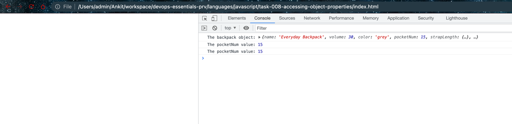

# Accessing object properties

## Dot notation and Bracket notation

```javascript
console.log("The backpack object:", backpack);
console.log("The pocketNum value:", backpack.pocketNum);

var query="pocketNum"

console.log("The pocketNum value:", backpack[query])
```

The JavaScript code demonstrates how to access properties of an object.

`console.log("The backpack object:", backpack);`
This line of code logs the entire backpack object to the console. If you were to run this code, you would see all the properties and their values of the backpack object printed out.

`console.log("The pocketNum value:", backpack.pocketNum);`
This line of code logs the value of the `pocketNum` property from the backpack object. In JavaScript, you can access the property of an object using dot notation as shown here.

`var query="pocketNum"`
This line of code assigns the string "pocketNum" to a variable called `query`. 

`console.log("The pocketNum value:", backpack[query])`
Finally, this line of code demonstrates another way to access object properties: bracket notation. When you have a property name as a string (in this case, stored in the `query` variable), you can use bracket notation to access the property. This line of code will output the same value as `backpack.pocketNum`.

So in short, this code is demonstrating two ways of accessing object properties in JavaScript: dot notation (`backpack.pocketNum`) and bracket notation (`backpack[query]`).

