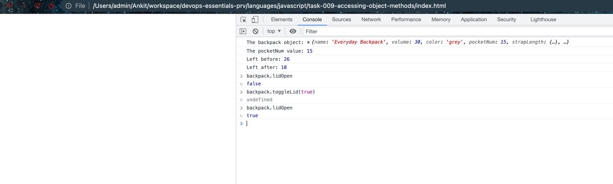

# Accessing Object Methods

- Accessing object methods

  - In the following screenshot we didn't change the value in script.js. This value only changed inside the browser and that's kind of the point of having these methods. We can now pass an object to the browser and then change its properties at will using the methods and those changes only happen in the user's computer in the user's browser at that moment.

