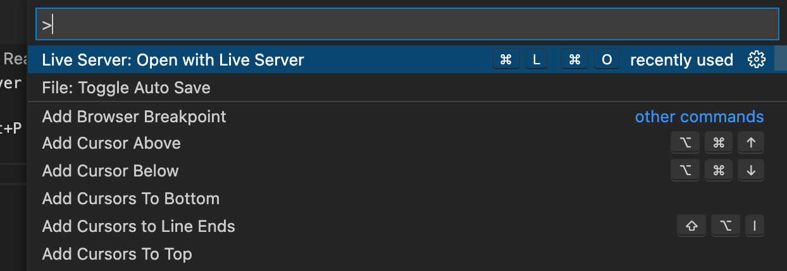

# Classes : Object Blueprints

## Code

```javascript
/**
 * Creating classes:
 *
 * Class declaration: class Name {}
 * Class expression:  const Name = class {}
 */

class Backpack {
  constructor(
    // Defines parameters:
    name,
    volume,
    color,
    pocketNum,
    strapLengthL,
    strapLengthR,
    lidOpen
  ) {
    // Define properties:
    this.name = name;
    this.volume = volume;
    this.color = color;
    this.pocketNum = pocketNum;
    this.strapLength = {
      left: strapLengthL,
      right: strapLengthR,
    };
    this.lidOpen = lidOpen;
  }
  // Add methods like normal functions:
  toggleLid(lidStatus) {
    this.lidOpen = lidStatus;
  }
  newStrapLength(lengthLeft, lengthRight) {
    this.strapLength.left = lengthLeft;
    this.strapLength.right = lengthRight;
  }
}

export default Backpack;
```

This code defines a JavaScript ES6 class named `Backpack`. A class is a blueprint for creating objects with specific properties and methods.

Let's break it down:

1. `constructor()`: This is a special method for creating and initializing an object created from a class. It runs when an object is instantiated with `new`. In this case, it accepts parameters for `name`, `volume`, `color`, `pocketNum`, `strapLengthL`, `strapLengthR`, and `lidOpen`.

2. `this`: Inside the constructor, `this` refers to the new object it will create.

3. `this.name = name;`: This line assigns the value of the `name` parameter to the `name` property of the new object.

4. `this.strapLength = { left: strapLengthL, right: strapLengthR };`: This line creates a `strapLength` property on the new object, which is itself an object with `left` and `right` properties. These represent the lengths of the left and right straps of the backpack.

5. `toggleLid(lidStatus)`: This is a method defined inside the class. It accepts a parameter `lidStatus` and sets the `lidOpen` property of the backpack object to the value of `lidStatus`.

6. `newStrapLength(lengthLeft, lengthRight)`: This is another method defined inside the class. It accepts two parameters, `lengthLeft` and `lengthRight`, and updates the `left` and `right` properties of the `strapLength` object.

7. `export default Backpack;`: This line exports the `Backpack` class as a module, which means it can be imported and used in other JavaScript files.

To create a new `Backpack` object with this class, you would do something like this:

```javascript
const myBackpack = new Backpack("Campus Backpack", 30, "black", 15, 26, 26, false);
```

This would create a new backpack object with the given values.

## Screenshots

- Start the live server first

> Mac - command+shift+P



- object blueprint with classes


