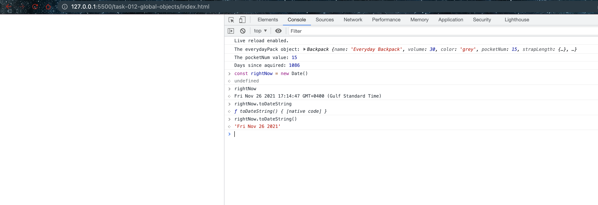

# Global Objects

## Code

```javascript
class Backpack {
  constructor(
    name,
    volume,
    color,
    pocketNum,
    strapLengthL,
    strapLengthR,
    lidOpen,
    dateAcquired
  ) {
    this.name = name;
    this.volume = volume;
    this.color = color;
    this.pocketNum = pocketNum;
    this.strapLength = {
      left: strapLengthL,
      right: strapLengthR,
    };
    this.lidOpen = lidOpen;
    this.dateAcquired = dateAcquired;
  }
  toggleLid(lidStatus) {
    this.lidOpen = lidStatus;
  }
  newStrapLength(lengthLeft, lengthRight) {
    this.strapLength.left = lengthLeft;
    this.strapLength.right = lengthRight;
  }
  backpackAge() {
    let now = new Date();
    let acquired = new Date(this.dateAcquired);
    let elapsed = now - acquired; // elapsed time in milliseconds
    let daysSinceAcquired = Math.floor(elapsed / (1000 * 3600 * 24));
    return daysSinceAcquired;
  }
}

export default Backpack;
```
In the given code, a `Backpack` class is defined. One of the methods in this class, `backpackAge`, makes use of the `Date` global object in JavaScript.

Here's how the `Date` global object is used:

1. `let now = new Date();` - This line of code creates a new `Date` object that contains the current date and time. `Date` is a global object in JavaScript, meaning it can be used anywhere in your code. 

2. `let acquired = new Date(this.dateAcquired);` - This line creates a new `Date` object from `this.dateAcquired`, which is a property of the `Backpack` object.

3. `let elapsed = now - acquired;` - This line calculates the difference between the current date and time (`now`) and the `dateAcquired`. The difference is calculated in milliseconds.

4. `let daysSinceAcquired = Math.floor(elapsed / (1000 * 3600 * 24));` - This line converts the elapsed time from milliseconds to days. Here, `Math` is another global object in JavaScript, providing mathematical functions and constants.

5. Finally, `return daysSinceAcquired;` returns the number of days since the backpack was acquired.

In JavaScript, there are several other global objects available, such as `Array`, `Boolean`, `Number`, `String`, and more, each with their own methods and properties. These global objects form part of the JavaScript built-in library.

## Screenshot

- Running global object


