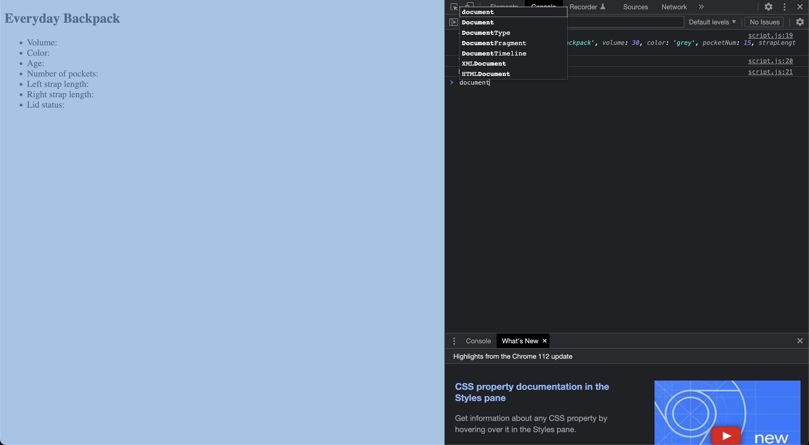
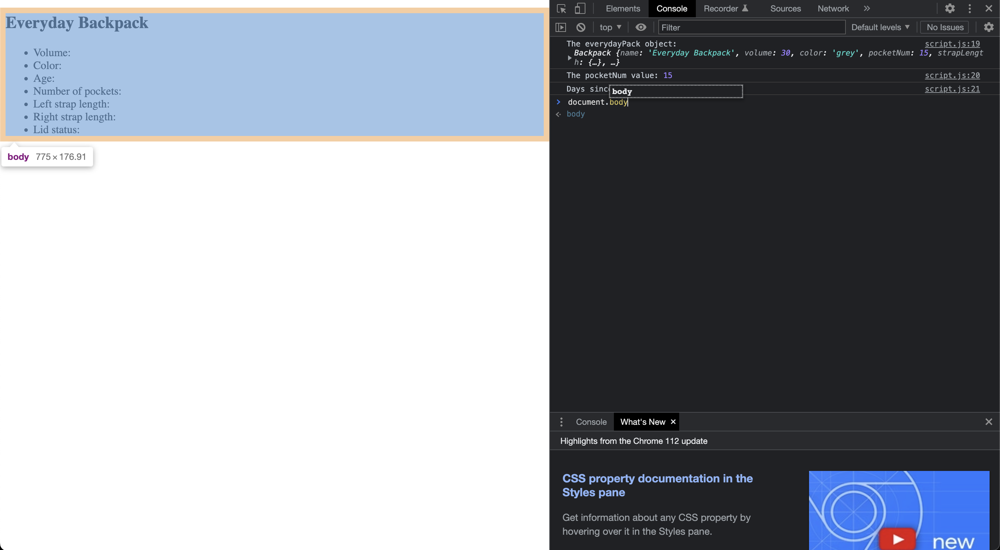
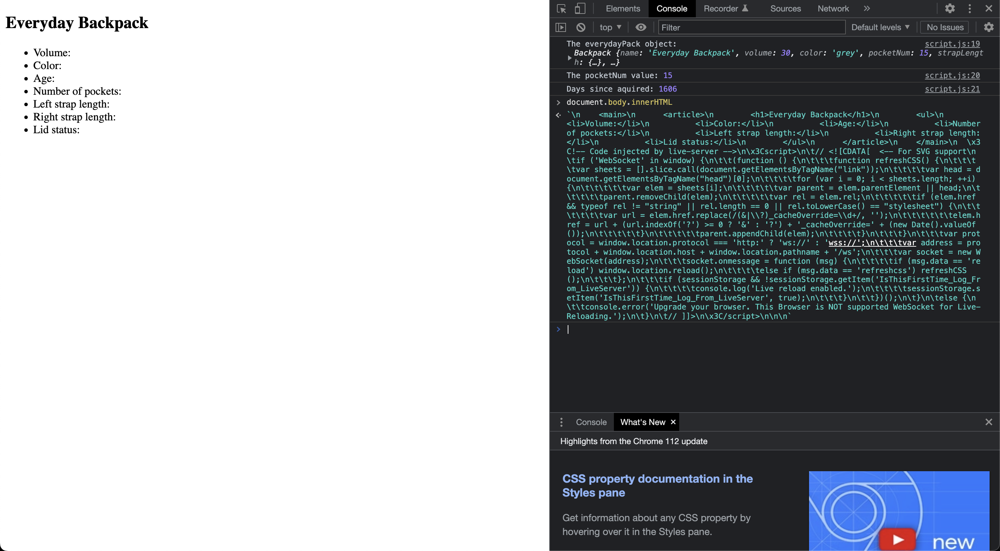
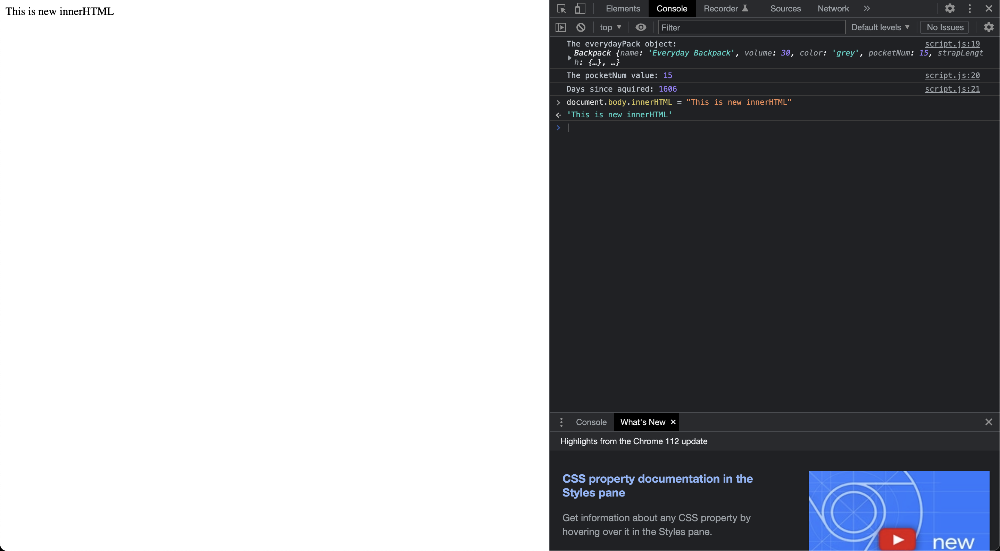
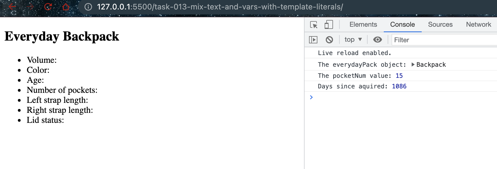

# Mix text and variables with template literals

## Document Object Model

The Document Object Model (DOM) is a programming interface for web documents. It represents the structure of a web page as a tree-like structure where each node is an object representing a part of the web page. The DOM represents a document as a structured group of objects, so you can change the document structure, style, and content. 

The DOM connects web pages to scripts or programming languages. When a web page is loaded, the browser creates the DOM of the page, which is an object-oriented representation of an HTML document, that acts as an interface that programs can interact with.

1. `document` is a built-in object in JavaScript, and it's a part of the Web API provided by the browser. When you type `document` in the browser console, it returns the `document` object, which represents the whole web page loaded in the browser.

2. The `document` object is a built-in object that provides a ton of methods and properties that allow you to manipulate the web page.

3. When you look at the output of `document` in the console, you're looking at the DOM representation of the current page. Each element of the HTML document (like tags, attributes, and text) is represented as an object in the DOM.

4. Therefore, when a webpage is loaded, the browser creates this DOM, which scripts and programming languages can interact with to dynamically change the document's structure, style, and content.

In other words, the DOM is the data representation of the objects that comprise the structure and content of a document and it provides a way to manipulate a document's structure, style, and content.

- When you type `document` in console

- When you type `document.body` in console

- When you type the `document.body.innerHTML` in console to get the innerHTML

- When you set the `innerHTML` to something else

- Initial load

