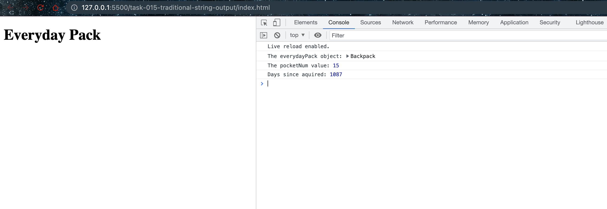

# Traditional String Output

## Code

```javascript
import Backpack from "./Backpack.js";

const everydayPack = new Backpack(
  "Everyday Pack",
  30,
  "grey",
  15,
  26,
  26,
  false,
  "December 5, 2018 15:00:00 PST"
);

const content = "<h1>" + everydayPack.name + "</h1>";

document.body.innerHTML = content;

console.log("The everydayPack object:", everydayPack);
console.log("The pocketNum value:", everydayPack.pocketNum);
console.log("Days since aquired:", everydayPack.backpackAge());
```

This code is an example of how to dynamically generate HTML using string concatenation in JavaScript, which was the common approach prior to the introduction of template literals in ES6.

1. An instance of the `Backpack` class, `everydayPack`, is created.

2. A new string, `content`, is created to hold an HTML string. The string concatenation operator (`+`) is used to combine the fixed part of the string (the `<h1>` tags) with the dynamic part, `everydayPack.name`.

   ```javascript
   const content = "<h1>" + everydayPack.name + "</h1>";
   ```

   Here, `everydayPack.name` is a variable, and its value is inserted between the `<h1>` tags.

3. This `content` string is then set as the HTML content of the `body` element in the HTML document, using the `innerHTML` property of the `body` element: `document.body.innerHTML = content;`. This effectively sets the name of the backpack as the main header in the webpage.

4. The code then logs the `everydayPack` object, the value of its `pocketNum` property, and the number of days since it was acquired to the console.

This method of using string concatenation to create dynamic HTML content can quickly become cumbersome and hard to read, especially for larger chunks of HTML or more complex data. It's also prone to errors, as it requires careful handling of spaces and other formatting details. These issues are part of why template literals were introduced in ES6.

## Screenshot

- Running with traditional string output


