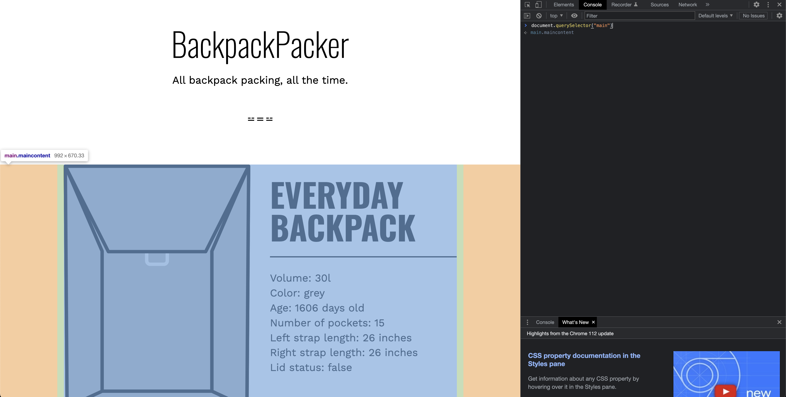
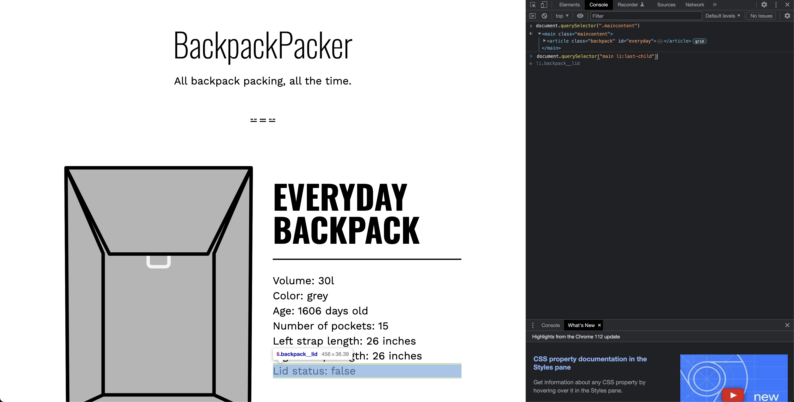
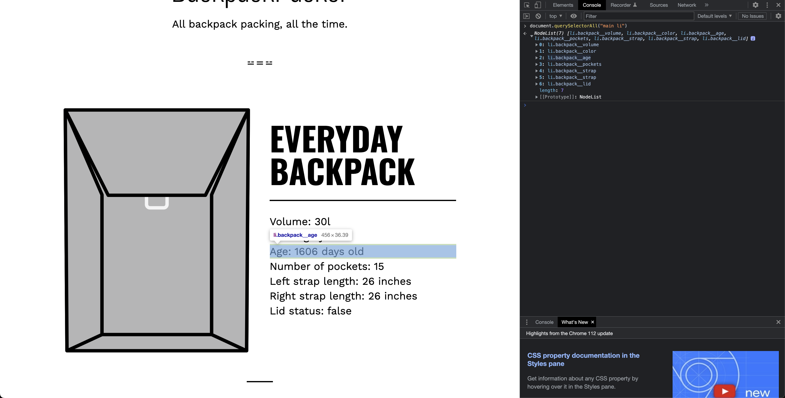
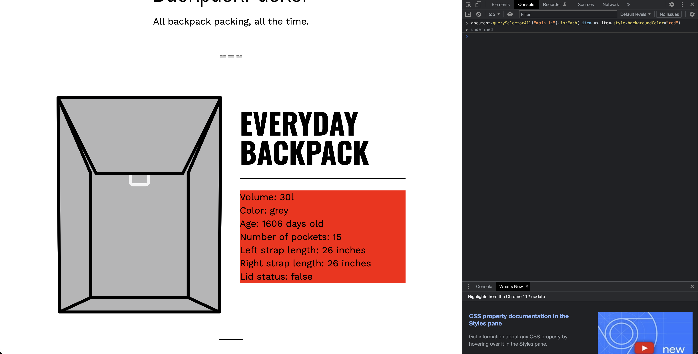
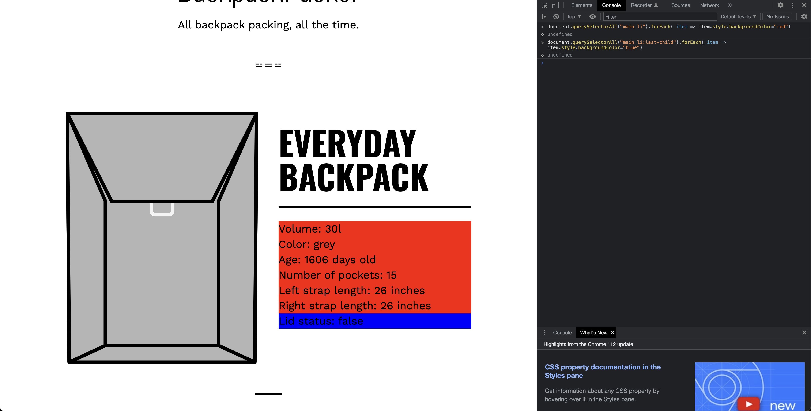

# Accessing elements with query selector

- [querySelector](https://developer.mozilla.org/en-US/docs/Web/API/Document/querySelector)
- [querySelectorAll](https://developer.mozilla.org/en-US/docs/Web/API/Document/querySelectorAll)

The `document.querySelector()` and `document.querySelectorAll()` methods are both used to select elements from the DOM (Document Object Model) based on CSS selectors. However, they differ in the number of elements they return:

1. `document.querySelector()`: This method returns the first element that matches the specified CSS selector(s). If no matches are found, it returns null. In your example, `document.querySelector("main li:last-child")` will return the last `<li>` element that is a child of a `<main>` element.

    - `"main li:last-child"`: This is a CSS selector that selects the last child `<li>` element of a `<main>` element.

2. `document.querySelectorAll()`: This method returns a NodeList (not an array, but a collection that can be looped over like an array) of all elements in the document that match the specified CSS selector(s). If no matches are found, it returns an empty NodeList. `document.querySelectorAll("")` will return an empty NodeList because no selector is specified in the quotes. 

    - For example, `document.querySelectorAll("p")` will select all `
` elements in the document.

Both `querySelector()` and `querySelectorAll()` are very useful for manipulating HTML elements with JavaScript. For example, you might use `querySelector()` to add an event listener to a button, or `querySelectorAll()` to change the color of all elements with a certain class name.

## Screenshots

- Getting the main element using `document.querySelector("main")`

- Getting the same main element, but this time using the classname

- Getting the `last-child` using `document.querySelector("main li:last-child")`

- Getting a nodelist of elements using `document.querySelectorAll("main li")`

- Making the background color `red` by grabbing each item in `forEach` loop

- Making the color of `li:last-child` to `blue` explicitly

