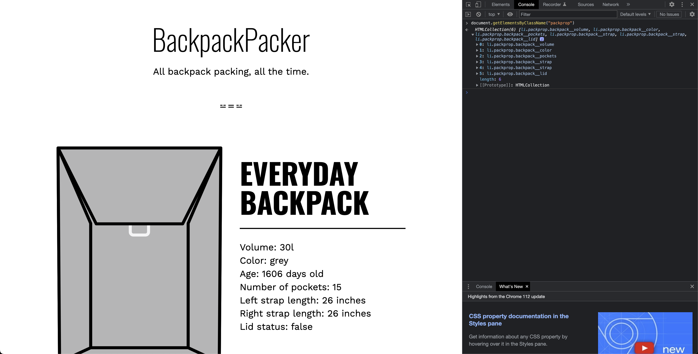
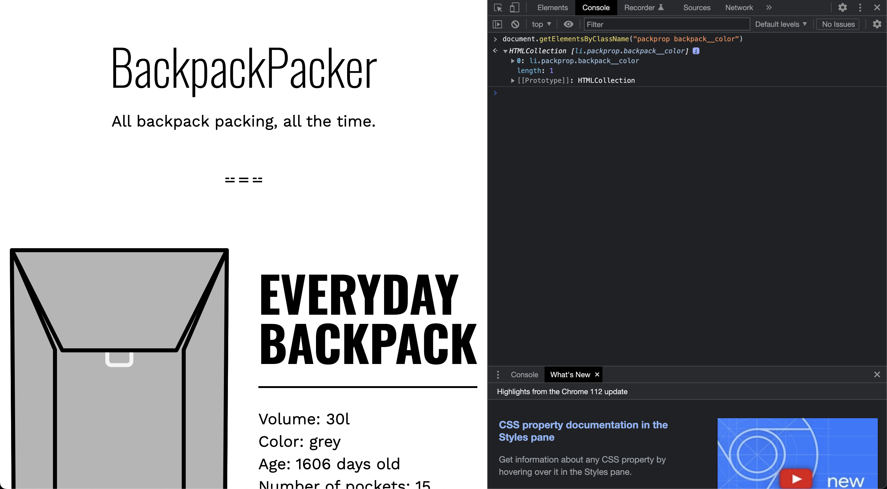
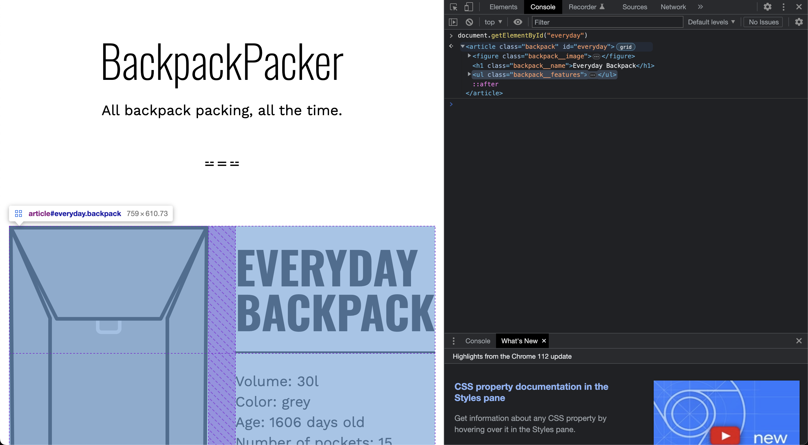

# Access Elements Using Older Methods

- [getElementsByClassName](https://developer.mozilla.org/en-US/docs/Web/API/Document/getElementsByClassName)
- [getElementById](https://developer.mozilla.org/en-US/docs/Web/API/Document/getElementById)

The `element.getElementsByClassName()` and `Document.getElementById()` methods are both used to select elements from the DOM (Document Object Model). Here's how they work:

1. `element.getElementsByClassName()`: This method returns a live HTMLCollection of all child elements which have all of the given class names. The `element` can be any DOM element or the `document` object. The method is live, meaning it automatically updates when the document changes.

    - For example, if you have several elements with the class name "myClass", you could select all of them like this: `document.getElementsByClassName("myClass")`.

    - Note that unlike `document.querySelectorAll()`, `getElementsByClassName()` returns a live HTMLCollection. This means if you add or remove an element with the class name in the document, the collection will update automatically.

2. `Document.getElementById()`: This method returns a reference to the first element with the specified ID. Element IDs should be unique within a document, so it is considered an error if more than one element has the same ID.

    - For example, if you have an element with the ID "myElement", you could select it like this: `document.getElementById("myElement")`.

    - Note that `getElementById()` is a method of the `document` object, not individual element objects, because IDs are unique within the entire document.

Both methods are very useful for manipulating HTML elements with JavaScript. For example, you might use `getElementsByClassName()` to change the style of all elements with a certain class name, or `getElementById()` to add text to a specific element.

## Screenshot

- Running `document.getElementsByClassName("packprop")` to get live HTML collection of elements with class name `packprop`

- Running `document.getElementsByClassName("packprop backpack__color")` to get live HTML collection of elements with class name `packprop backpack__color`

- Running `document.getElementById("everyday")` to get element with ID `everyday`

