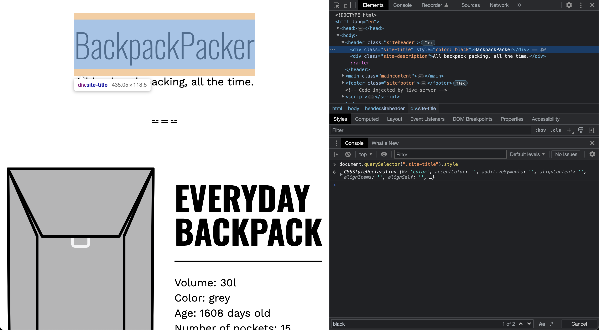
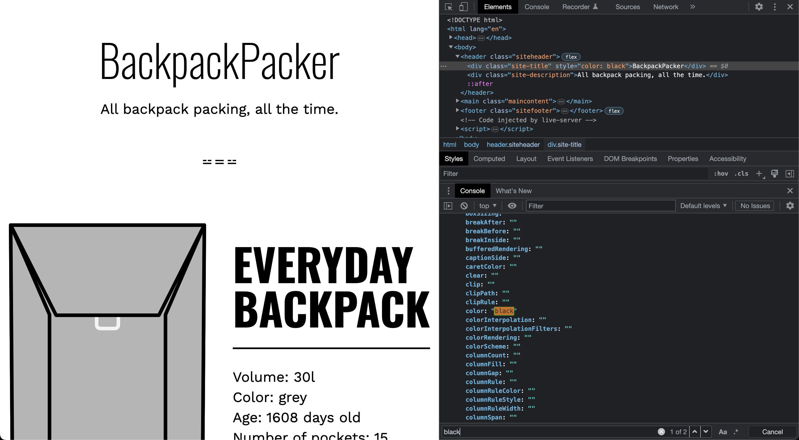
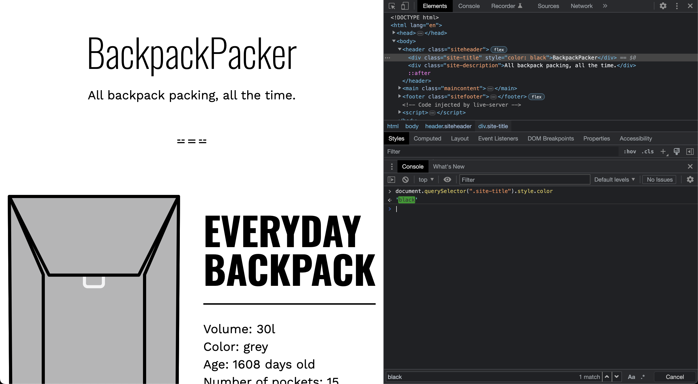
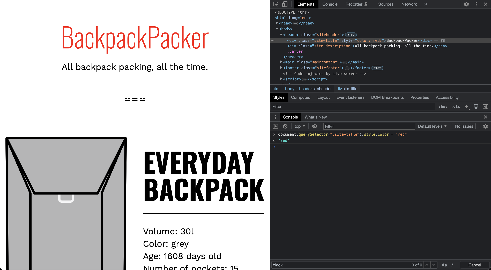
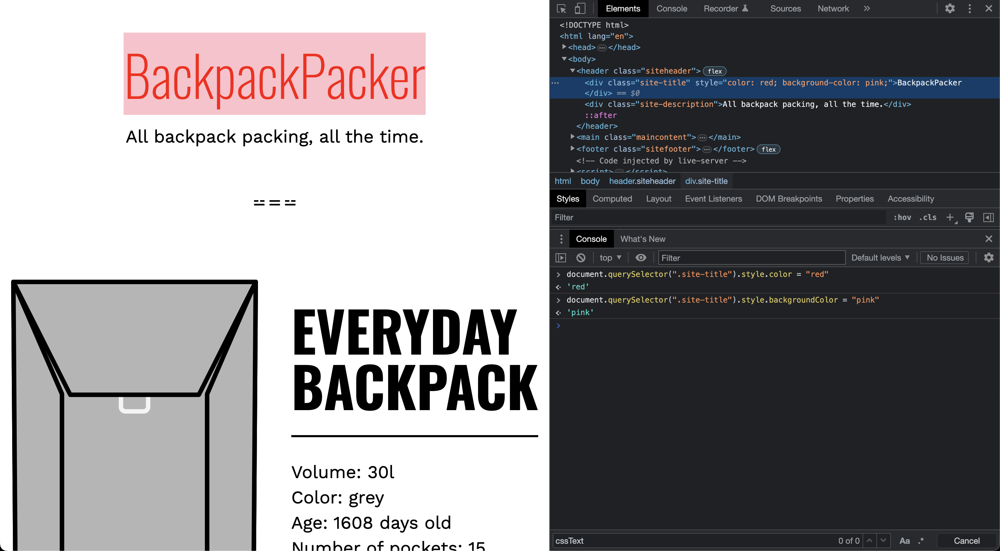

# Inline Style

- [ElementCSSInlineStyle/style](https://udn.realityripple.com/docs/Web/API/ElementCSSInlineStyle/style)

## What exactly is inline style?

The term "inline" in the context of HTML and CSS refers to a style that is applied directly to an HTML element, instead of being defined in an external stylesheet or in the head section of the HTML document.

Inline styles are defined using the "style" attribute in the HTML tag and contain CSS property-value pairs that apply only to that specific element. For example, the following code defines an inline style that sets the font color of a paragraph to red:

```html
<p style="color: red;">This is a red text.</p>
```

In this example, the "style" attribute is used to define an inline style for the "p" element. The "color" property is set to "red", which changes the font color of the text inside the "p" element to red.

The advantage of using inline styles is that they can be used to quickly apply small, specific styles to individual elements without having to create an entire stylesheet or modify an existing one. However, they can make the HTML code harder to read and maintain, especially when many elements have inline styles. Additionally, inline styles override any styles defined in external stylesheets or in the head section of the HTML document, which can make it harder to maintain a consistent style across an entire website.

## ElementCSSInlineStyle.style

`ElementCSSInlineStyle.style` is a property in JavaScript that allows you to access or modify the inline style of an HTML element. The inline style of an element is defined using the "style" attribute in the HTML tag, and it contains CSS property-value pairs that apply only to that specific element.

Here's an example:

```html
<div id="myDiv" style="color: red; font-size: 16px;">This is a red text.</div>
```

In the above code, the `style` attribute is used to define the inline style of the `<div>` element. It sets the text color to red and font size to 16 pixels.

Now, let's say you want to modify the font size of the `myDiv` element using JavaScript. You can do it like this:

```javascript
const myDiv = document.getElementById('myDiv');
myDiv.style.fontSize = '20px';
```

The above code uses the `getElementById` method to get the `myDiv` element and then sets its `fontSize` property to `20px`. As a result, the font size of the text inside the `myDiv` element will be changed from 16 pixels to 20 pixels.

So, `ElementCSSInlineStyle.style` provides a convenient way to access and modify the inline style of an HTML element using JavaScript.

## Examples

- Let's get the `style` for `site-title` `div`



- Notice the populated `color` value as `black`



- Let's explicitly get the value for `color`



- Changing this `style` property to `red`



- And setting the `backgroundColor` to `pink`

