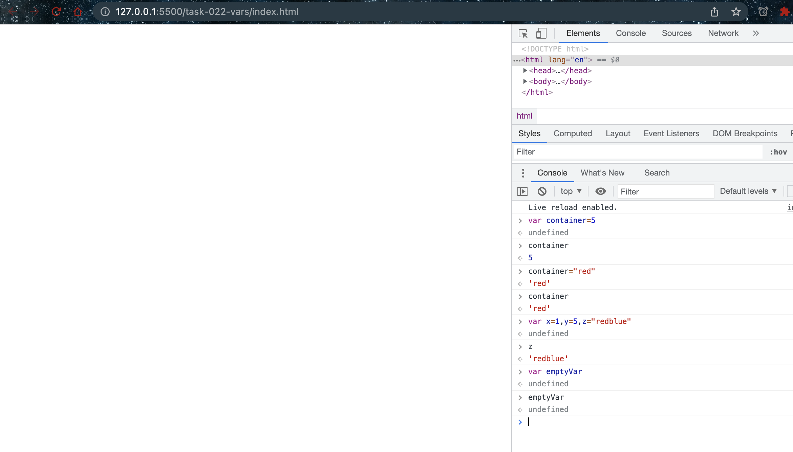
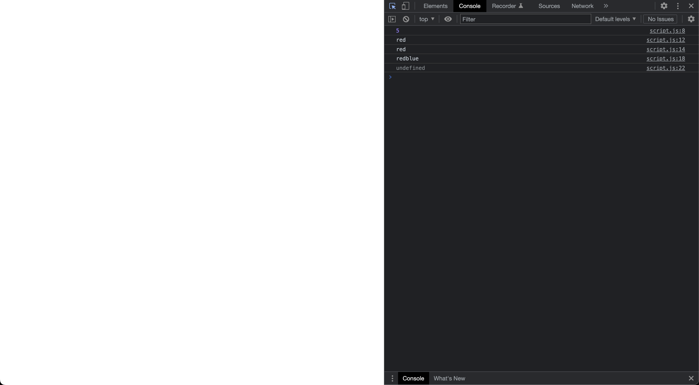

# Vars

- [var](https://developer.mozilla.org/en-US/docs/Web/JavaScript/Reference/Statements/var)

## Examples

### Executing directly on the console



### JS code

```javascript
var container = 5;

console.log(container);

container = "red";

console.log(container);

console.log(container);

var x = 1, y = 5, z = "redblue"

console.log(z);

var emptyVar

console.log(emptyVar);
```

### Explaination

The `var` keyword is used to declare a variable in JavaScript. In the examples provided, the `var` keyword is used to create several variables, including `container`, `x`, `y`, `z`, and `emptyVar`.

In JavaScript, variables can be used to store and manipulate values, such as numbers, strings, or objects. In the examples, the variables are assigned various values, including numbers, strings, and undefined values.

The first example shows the variables being created and assigned values directly in the console. When a variable is assigned a value in the console, it can be used immediately in subsequent statements.

The second example shows the same variables being declared and assigned values in a separate JavaScript file, `script.js`. The `console.log()` function is used to print the values of the variables to the console, allowing the programmer to see the values of the variables at different points in the code.

The `var` keyword is used to declare all of the variables in the examples. When a variable is declared with `var`, it is created with a function scope, meaning it can be accessed and modified within the function or block where it was declared. However, variables declared with `var` can also be accessed outside of the function or block where they were declared, which can lead to unexpected behavior or errors in some cases.

Overall, the `var` keyword is an important tool in JavaScript for declaring variables and managing data in a program.

### Output in console


