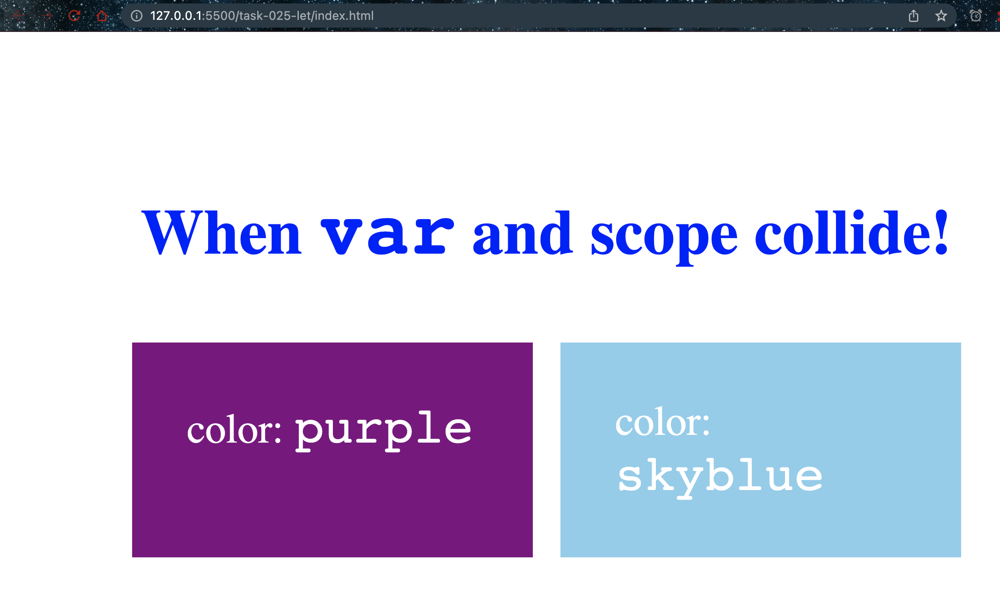
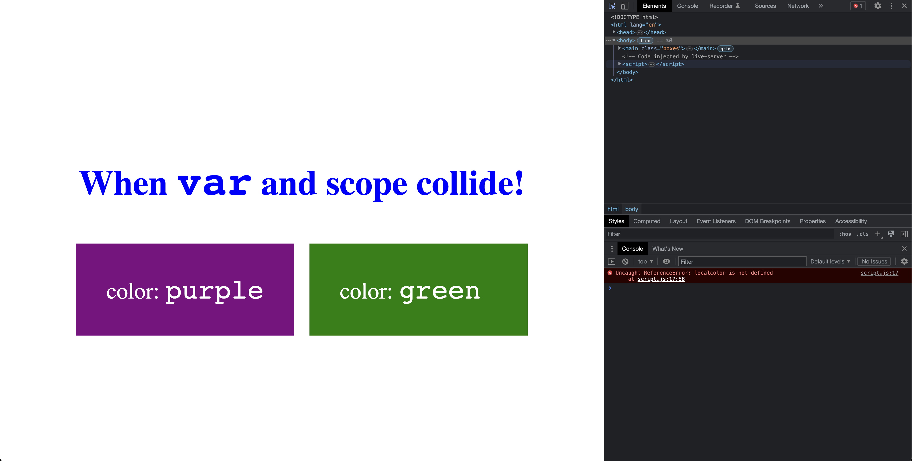

# Let

- [let](https://developer.mozilla.org/en-US/docs/Web/JavaScript/Reference/Statements/let)

## Examples

### When you use let, everything works as expected

```javascript
let color = "purple";

document.querySelector(".left").style.backgroundColor = color;
document.querySelector(".left .color-value").innerHTML = color;

color = "skyblue";

function headingColor() {
  let color = "blue";
  document.querySelector(".title").style.color = color;
}

headingColor();

document.querySelector(".right").style.backgroundColor = color;
document.querySelector(".right .color-value").innerHTML = color;
```



### When you encounter error, javascript stops rendering, and default color is green

```javascript
let color = "purple";

document.querySelector(".left").style.backgroundColor = color;
document.querySelector(".left .color-value").innerHTML = color;

color = "skyblue";

function headingColor() {
  let localcolor = "blue";
  document.querySelector(".title").style.color = localcolor;
}

headingColor();

// Should give error as localcolor is not defined in global scope
// default color green should be assigned to right side box
document.querySelector(".right").style.backgroundColor = localcolor;
document.querySelector(".right .color-value").innerHTML = localcolor;
```



### Learnings

From the given code and screenshot, we can learn the following about using `let` in JavaScript:

- Unlike `var`, variables declared with `let` have block scope, which means they can only be accessed and modified within the block of code they are declared in.
- In the first example, the use of `let` works as expected, and the variable `color` can be updated and accessed correctly within the different blocks of code.
- In the second example, an error is encountered when trying to access the `localcolor` variable outside of its block scope, which causes the JavaScript execution to stop. This prevents the rest of the code from running, and the default color of green is assigned to the right side box as specified in the HTML code.
- When using `let`, it is important to be aware of the scope of variables and where they can be accessed, to avoid errors and unexpected behavior in the code.

Overall, using `let` instead of `var` in JavaScript can help to prevent bugs and make the code more predictable and easier to maintain, especially in large and complex programs.
