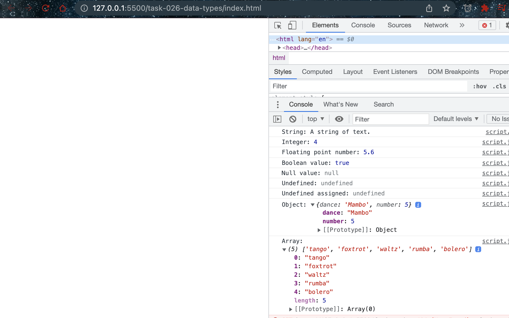
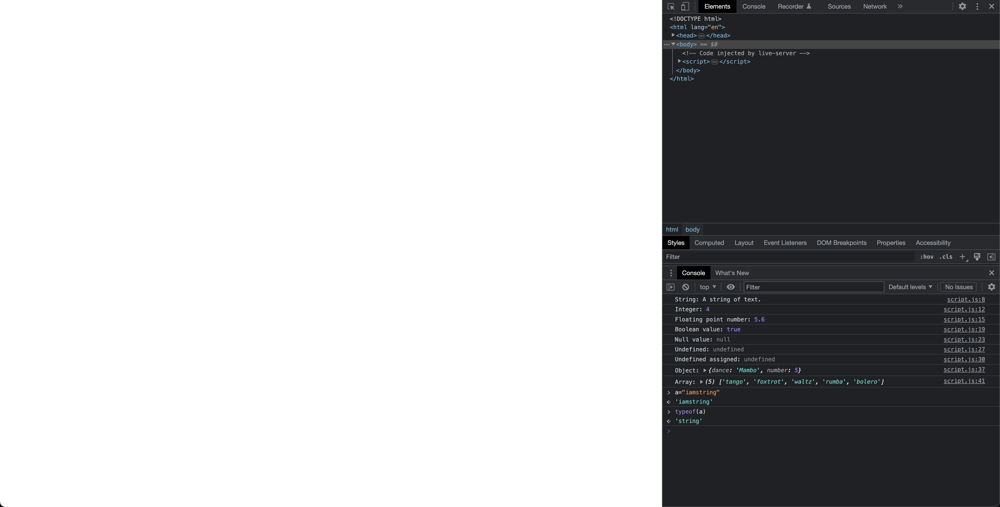

# Data types

- [Data_structures](https://developer.mozilla.org/en-US/docs/Web/JavaScript/Data_structures)

## Javascript code

```javascript
/**
 * Data types in JavaScript
 * @link https://developer.mozilla.org/en-US/docs/Web/JavaScript/Data_structures
 */

// String:
let stringDemo = "A string of text.";
console.log("String:", stringDemo);

// Numbes:
let integerDemo = 4;
console.log("Integer:", integerDemo);

let floatDemo = 5.6;
console.log("Floating point number:", floatDemo);

// Boolean:
let booleanDemo = true;
console.log("Boolean value:", booleanDemo);

// Null value (nothing):
let nullDemo = null;
console.log("Null value:", nullDemo);

// Undefined:
let undefinedDemo;
console.log("Undefined:", undefinedDemo);

let undefinedAssignedDemo = undefined;
console.log("Undefined assigned:", undefinedAssignedDemo);

// Object:
const objectDemo = {
  dance: "Mambo",
  number: 5,
};
console.log("Object:", objectDemo);

// Array:
const arrayDemo = ["tango", "foxtrot", "waltz", "rumba", "bolero"];
console.log("Array:", arrayDemo);
```

## Explaination

This JavaScript code demonstrates the different data types in the language:

1. String: A string is a sequence of characters enclosed in double or single quotes. The variable "stringDemo" holds a string value "A string of text."

2. Numbers: There are two types of number values in JavaScript: integers and floating-point numbers. The variable "integerDemo" holds an integer value 4, and "floatDemo" holds a floating-point number value 5.6.

3. Boolean: A Boolean is a true/false value. The variable "booleanDemo" holds a Boolean value true.

4. Null: A null value represents the intentional absence of any object value. The variable "nullDemo" holds a null value.

5. Undefined: A variable that has been declared but not assigned any value is undefined. The variable "undefinedDemo" is declared but not assigned a value. 

6. Object: An object is a collection of key-value pairs enclosed in curly braces. The variable "objectDemo" holds an object with two properties: "dance" and "number."

7. Array: An array is a collection of values that can be of any data type. The variable "arrayDemo" holds an array of five string values: "tango", "foxtrot", "waltz", "rumba", and "bolero".

## Examples



- We can use `typeof` to get the `data-type` of a variable


