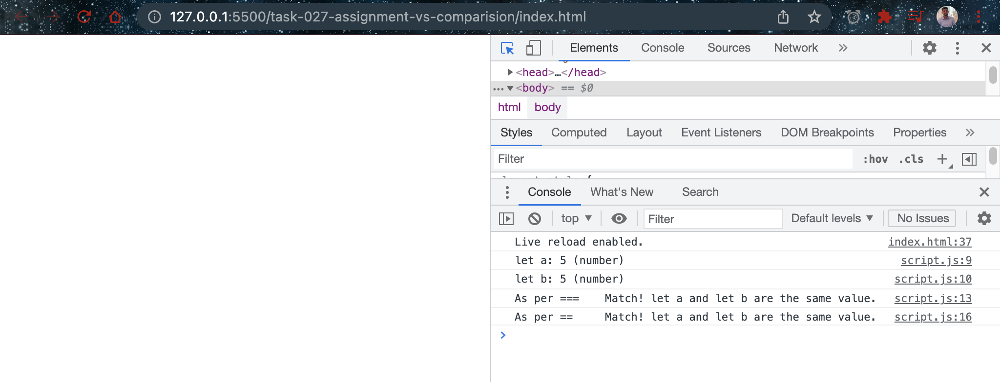
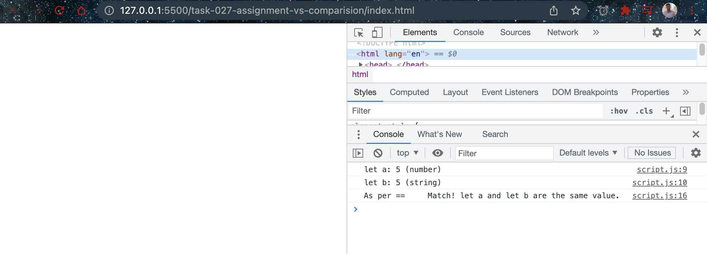

# Assignment vs Comparision

- [Relational Operators](https://developer.mozilla.org/en-US/docs/Web/JavaScript/Reference/Operators#Relational_operators)

## Javascript Code

```javascript
let a = 5;
let b = "5";

console.log(`let a: ${a} (${typeof a})`);
console.log(`let b: ${b} (${typeof b})`);

if (a === b) {
  console.log(`As per ===    Match! let a and let b are the same value.`);
} 
if (a == b) {
  console.log(`As per ==     Match! let a and let b are the same value.`);
}
else {
  console.error(`No match: let a and let b are NOT same value.`);
}
```

## Explaination

This JavaScript code demonstrates the use of relational operators to compare the values of two variables.

The code initializes two variables: "a" and "b". 

The variable "a" is assigned a numeric value of 5 using the assignment operator (=). The variable "b" is assigned a string value of "5" using the same operator. 

The code then uses console.log() to print the values of the two variables along with their respective data types using the template literals. 

The code then uses two if statements to compare the values of "a" and "b" using the equality operators "===" and "==", respectively. 

The first if statement uses the strict equality operator "===" to check if "a" is equal to "b". Since "a" is a number and "b" is a string, they are not strictly equal, and the if statement fails.

The second if statement uses the loose equality operator "==" to check if "a" is equal to "b". This operator performs type coercion to convert one of the operands to the other's type, and in this case, the string value "5" is converted to a numeric value 5, making them equal. The if statement succeeds and prints a message to the console indicating that the two variables have the same value.

Finally, since the else statement is not part of the first if statement, it executes unconditionally after the second if statement completes. It prints an error message to the console indicating that the two variables are not strictly equal. 

In conclusion, the code shows how to use relational operators to compare the values of variables in JavaScript.

## Examples

- when b=5



- when b="5"


