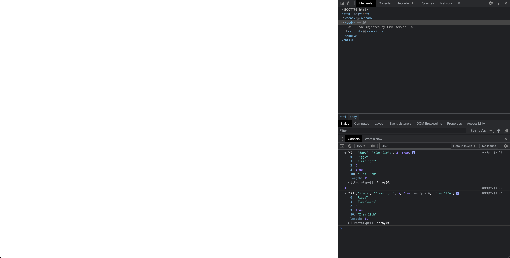

# Arrays

- [Arrays](https://developer.mozilla.org/en-US/docs/Learn/JavaScript/First_steps/Arrays)

## Javascript Code

```javascript
let item = "flashlight";

const collection = ["Piggy", item, 5, true];

console.log(collection);

console.log(collection.length);

collection[10] = "I am 10th";

console.log(collection)
```

## Explaination

This JavaScript code outputs the contents of an array "collection" and the length of the array after modifying it:

The first console.log() statement outputs the contents of the array "collection". It shows that the array contains four elements: "Piggy", "flashlight", 5, and true.

The second console.log() statement outputs the length of the array "collection". Since the array contains four elements, its length is 4.

The third console.log() statement modifies the array by adding an element at index 10 using the assignment operator (=). This creates a "sparse" array, with elements 4 through 9 being undefined or "empty". The new element, "I am 10th", is added at index 10.

The fourth console.log() statement outputs the modified contents of the array "collection". It shows that the array now contains 11 elements, with elements 4 through 9 being empty. The element "I am 10th" is added at index 10.

In JavaScript, arrays can be modified dynamically by adding or removing elements. When an element is added at an index that is beyond the current length of the array, the array is automatically expanded to accommodate the new element, creating empty or undefined elements in between. The length of the array is also updated to reflect the new number of elements.

### But when I expand the first console.log output, why do I see "I am 10th" which is not added yet?

This is because when you access an index that has not been assigned a value yet, JavaScript returns "undefined" by default. In the case of the first console.log() statement, since the array "collection" has been initialized with four elements, its indices 0 to 3 are assigned values, but indices 4 to 9 are empty or undefined. Therefore, when you expand the output, you will see the values assigned to indices 0 to 3, followed by empty slots for indices 4 to 9, and then the value "I am 10th" at index 10.

It's important to note that the fact that the value "I am 10th" is visible in the console does not mean it was added to the array at the time of the first console.log() statement. It simply means that the console is displaying the current state of the array, including empty slots and undefined values.

## Example

- Arrays output in console


