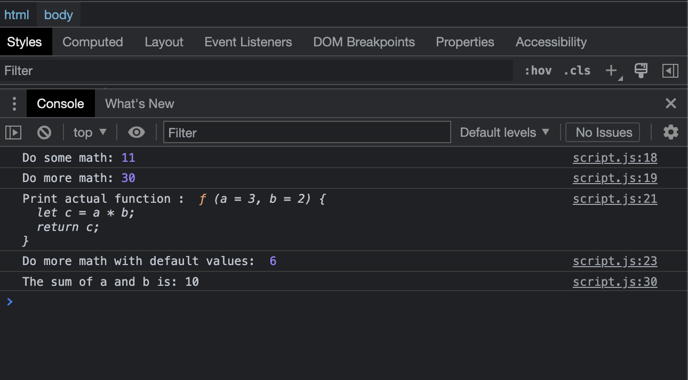

# Functions and methods

- [Function](https://developer.mozilla.org/en-US/docs/Glossary/Function)

## Javascript Code

```javascript
// Function declaration:
function doSomeMath(a, b) {
  let c = a + b;
  return c;
}

// Function expression:
const doMoreMath = function (a = 3, b = 2) {
  let c = a * b;
  return c;
};

console.log("Do some math:", doSomeMath(5, 6));
console.log("Do more math:", doMoreMath(5, 6));

console.log("Print actual function : ", doMoreMath);

console.log("Do more math with default values: ", doMoreMath());

// Immediately Invoked Function Expression (IIFE)
(function () {
  let a = 4;
  let b = 6;
  let c = doSomeMath(a, b);
  console.log(`The sum of a and b is: ${c}`);
})();
```

## Explaination

This JavaScript code demonstrates the use of functions in the language:

The code defines two functions: "doSomeMath" and "doMoreMath".

The "doSomeMath" function is declared using the "function" keyword, followed by the function name and a pair of parentheses containing the function parameters, which are "a" and "b". Inside the function, the sum of "a" and "b" is calculated and stored in a variable "c", which is then returned as the result of the function.

The "doMoreMath" function is defined as a function expression, which means that it is assigned to a variable "doMoreMath" using the "const" keyword. The function takes two optional parameters "a" and "b", which default to the values 3 and 2 respectively if not provided. Inside the function, the product of "a" and "b" is calculated and stored in a variable "c", which is then returned as the result of the function.

The code then uses console.log() to call the two functions with different arguments and output their return values to the console. It also logs the actual function "doMoreMath" to the console, which outputs the function definition.

The code then calls the "doMoreMath" function again with no arguments, which causes it to use the default values of 3 and 2.

Finally, the code defines an Immediately Invoked Function Expression (IIFE) that calls the "doSomeMath" function with two variables "a" and "b" set to the values 4 and 6 respectively, and logs the result to the console.

In conclusion, this code demonstrates the use of function declarations, function expressions, default function parameters, and IIFEs in JavaScript. Functions are an essential part of the language that allow developers to encapsulate and reuse blocks of code, making their programs more modular and easier to maintain.

## Screenshots


