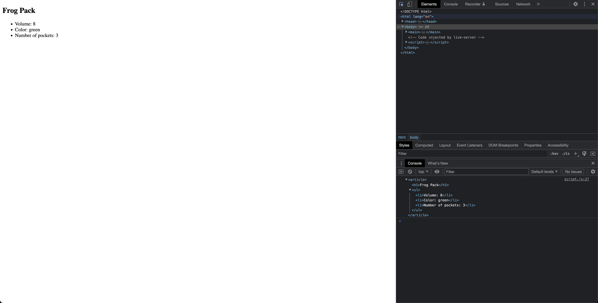

# Function Usage Example

- [Function](https://developer.mozilla.org/en-US/docs/Glossary/Function)

## Javascript Code

```javascript
const greenPack = {
  name: "Frog Pack",
  color: "green",
  volume: 8,
  pocketNum: 3,
};

const addPack = function (currentPack) {
  const newArticle = document.createElement("article");
  newArticle.innerHTML = `
    <h1>${currentPack.name}</h1>
    <ul>
      <li>Volume: ${currentPack.volume}</li>
      <li>Color: ${currentPack.color}</li>
      <li>Number of pockets: ${currentPack.pocketNum}</li>
    </ul>
  `;
  return newArticle;
};

const theArticle = addPack(greenPack);
console.log(theArticle);
const main = document.querySelector("main");
main.append(addPack(greenPack));
```

## Explaination

This JavaScript code demonstrates the use of a function to add an article element to a webpage:

The code defines an object "greenPack" with properties "name", "color", "volume", and "pocketNum".

The code defines a function "addPack" that takes a single parameter "currentPack". Inside the function, a new article element is created using the document.createElement() method, and its innerHTML property is set to a string that includes the values of the properties of the "currentPack" parameter. The new article element is then returned by the function.

The code then calls the "addPack" function with the "greenPack" object as an argument, which creates a new article element containing the details of the green pack, and assigns the element to the variable "theArticle". This variable is logged to the console to show that it contains the expected article element.

Finally, the code selects the "main" element on the webpage using the document.querySelector() method and appends a new article element containing the details of the green pack to it using the append() method.

In conclusion, functions in JavaScript are reusable blocks of code that can take input parameters, perform operations on those parameters, and return a result. In this example, the "addPack" function takes an object as an input parameter, creates a new article element containing the details of the object, and returns the article element. This function is then called with different objects as arguments to create article elements for different packs, demonstrating the reusability and flexibility of functions.

## Screenshots


