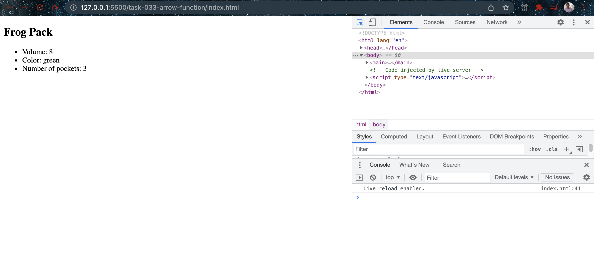

# Arrow function

- [Arrow Functions](https://developer.mozilla.org/en-US/docs/Web/JavaScript/Reference/Functions/Arrow_functions)

## Javascript Code

```javascript
const greenPack = {
  name: "Frog Pack",
  color: "green",
  volume: 8,
  pocketNum: 3,
};

const addPack = (currentPack) => {
  const newArticle = document.createElement("article");
  newArticle.innerHTML = `
    <h1>${currentPack.name}</h1>
    <ul>
      <li>Volume: ${currentPack.volume}</li>
      <li>Color: ${currentPack.color}</li>
      <li>Number of pockets: ${currentPack.pocketNum}</li>
    </ul>
  `;
  return newArticle;
};

const main = document.querySelector("main");
main.append(addPack(greenPack));
```

## Explaination

This JavaScript code demonstrates the use of an arrow function to add an article element to a webpage:

The code is similar to the previous example, with the key difference being that the "addPack" function is defined using an arrow function instead of a regular function.

Arrow functions were introduced in ECMAScript 6 and provide a more concise syntax for defining functions. Instead of using the "function" keyword, arrow functions use a fat arrow notation "=>" to separate the function parameters and the function body. In this example, the "addPack" function is defined as an arrow function that takes a single parameter "currentPack", and its body is enclosed in curly braces.

Inside the arrow function, a new article element is created using the document.createElement() method, and its innerHTML property is set to a string that includes the values of the properties of the "currentPack" parameter. The new article element is then returned by the arrow function.

The code then selects the "main" element on the webpage using the document.querySelector() method and appends a new article element containing the details of the green pack to it using the append() method, just like in the previous example.

In conclusion, arrow functions are a shorthand syntax for defining functions in JavaScript, providing a more concise and readable alternative to regular functions. They work similarly to regular functions and can be used wherever regular functions are used, with a few minor differences in how they handle "this" and "arguments".

## Screenshots


