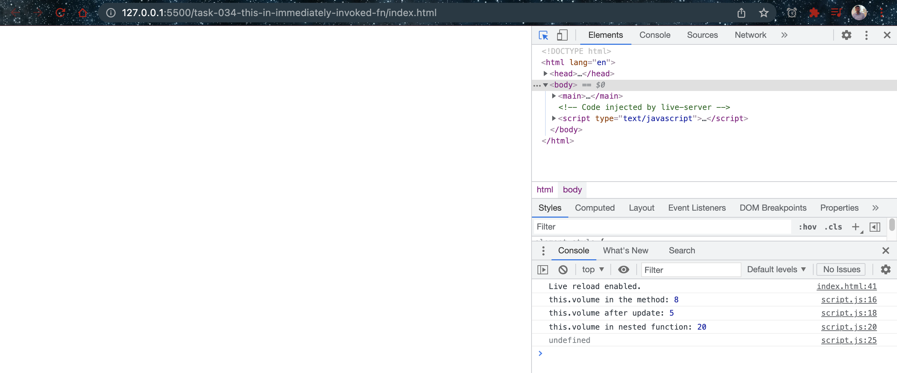

# This in normal and immediately invoked function

- [this_and_arrow_functions](https://developer.mozilla.org/en-US/docs/Web/JavaScript/Reference/Functions/Arrow_functions#this_and_Arrow_Functions)
- [this](https://developer.mozilla.org/en-US/docs/Web/JavaScript/Reference/Operators/this)

## Javascript Code

```javascript
// Define a default volume for the window (the entire DOM):
window.volume = 20;

const greenPack = {
  name: "Frog Pack",
  color: "green",
  volume: 8,
  pocketNum: 3,
  newVolume: function (volume) {
    console.log("this.volume in the method:", this.volume);
    this.volume = volume;
    console.log("this.volume after update:", this.volume);
    (function () {
      console.log("this.volume in nested function:", this.volume);
    })();
  },
};

console.log(greenPack.newVolume(5));
```

## Explaination

In JavaScript, the "this" keyword is used to refer to the current object or context in which the code is executing. The value of "this" depends on how the function is called and can be different in different contexts.

In the provided example code, the "this" keyword is used inside a method called "newVolume" of an object called "greenPack". The "newVolume" method takes a parameter "volume" and updates the volume property of the "greenPack" object with the given value.

Inside the "newVolume" method, "this" refers to the "greenPack" object because the method is called on the object. When the method is called with a value of 5, it first logs the current value of "this.volume", which is 8 (the default volume value defined on the object). Then, it updates the "volume" property of the object to 5 and logs the new value of "this.volume", which is 5.

The method also contains a nested immediately invoked function expression (IIFE) that logs the value of "this.volume" inside it. However, the value of "this" inside the IIFE is not the "greenPack" object but the global "window" object. This is because the IIFE creates a new function scope and "this" inside it refers to the "window" object by default.

One way to solve this issue is to use arrow functions, which do not create a new function scope and inherit the "this" value from their parent scope. So, replacing the nested function with an arrow function will make "this" inside it refer to the "greenPack" object.

In conclusion, "this" in JavaScript refers to the current object or context in which the code is executing, and its value depends on how the function is called. The value of "this" inside a function can be different from the value of "this" inside a nested function, and arrow functions can help solve scoping issues related to "this".

## Output And Explaination

The output of the provided code is:

```bash
this.volume in the method: 8
this.volume after update: 5
this.volume in nested function: 20
undefined
```

The output indicates that the "newVolume" method of the "greenPack" object is called with a value of 5, which updates the volume property of the object from 8 to 5. The first two lines of the output confirm this by logging the initial value of "this.volume" inside the method, which is 8, and the updated value of "this.volume", which is 5.

The third line of the output logs the value of "this.volume" inside a nested function that is immediately invoked inside the "newVolume" method. This nested function is defined using a regular function expression, which creates a new function scope and changes the value of "this". Inside the nested function, "this" refers to the global "window" object, which has a default volume value of 20. Therefore, the value of "this.volume" inside the nested function is 20.

The last line of the output logs "undefined" because the "newVolume" method does not return any value explicitly.

## Screenshots


