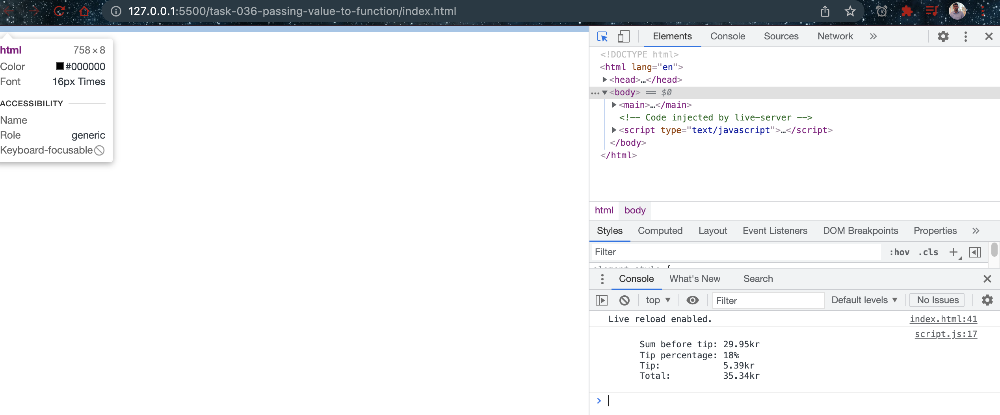

# Passing value to Function

- [Function](https://developer.mozilla.org/en-US/docs/Glossary/Function)

## Javascript Code

```javascript
const tipCalculator = (sum, percentage, currency, prefix) => {
  let tip = sum * (percentage / 100);
  let total = sum + tip;
  if (prefix) {
    console.log(`
      Sum before tip: ${currency}${sum}
      Tip percentage: ${percentage}%
      Tip:            ${currency}${tip.toFixed(2)}
      Total:          ${currency}${total.toFixed(2)}
    `);
  } else {
    console.log(`
      Sum before tip: ${sum}${currency}
      Tip percentage: ${percentage}%
      Tip:            ${tip.toFixed(2)}${currency}
      Total:          ${total.toFixed(2)}${currency}
    `);
  }
};

tipCalculator(29.95, 18, "kr", false);
```

## Explaination

The code defines an arrow function named "tipCalculator" that takes four parameters: "sum", "percentage", "currency", and "prefix". These parameters are used to calculate the tip, total, and to format and log the output to the console.

When the function is called, four arguments are passed in the following order: 29.95, 18, "kr", and false. These values correspond to the four parameters of the function.

The first argument, 29.95, is assigned to the "sum" parameter, which represents the sum of the bill before tip. The second argument, 18, is assigned to the "percentage" parameter, which represents the percentage of the bill to use as the tip. The third argument, "kr", is assigned to the "currency" parameter, which represents the currency symbol to use in the output. The last argument, false, is assigned to the "prefix" parameter, which is a boolean value that determines whether to include the currency symbol before or after the values in the output.

Based on the values of the parameters, the function calculates the tip and total, and then logs the output to the console using a template literal. The output format depends on the value of the "prefix" parameter, which determines whether the currency symbol should appear before or after the values in the output.

In this case, the output is:

```bash
Sum before tip: 29.95kr
Tip percentage: 18%
Tip:            5.39kr
Total:          35.34kr
```

This output is generated by the function because the fourth argument, false, is passed to the "prefix" parameter, which means that the currency symbol should appear after the values in the output.

## Screenshots

- Passing value to function


