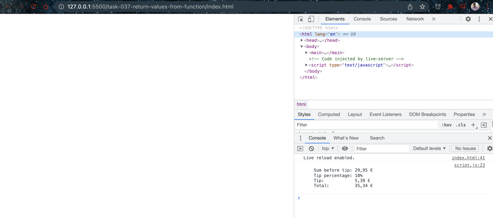

# Returning value from function

- [Function](https://developer.mozilla.org/en-US/docs/Glossary/Function)
- [NumberFormat](https://developer.mozilla.org/en-US/docs/Web/JavaScript/Reference/Global_Objects/Intl/NumberFormat)

List of ISO language codes:

- [langcode](http://www.lingoes.net/en/translator/langcode.htm)

## Javascript Code

```javascript
const formatter = (locale = "en-US", currency = "USD", value) => {
  let formattedValue = new Intl.NumberFormat(locale, {
    style: "currency",
    currency: currency,
  }).format(value);

  return formattedValue;
};

const tipCalculator = (sum, percentage, locale, currency) => {
  let tip = sum * (percentage / 100);
  let total = sum + tip;

  console.log(`
    Sum before tip: ${formatter(locale, currency, sum)}
    Tip percentage: ${percentage}%
    Tip:            ${formatter(locale, currency, tip)}
    Total:          ${formatter(locale, currency, total)}
  `);
};

tipCalculator(29.95, 18, "de-DE", "EUR");
```

## Explaination

The code demonstrates how to return values from a function in JavaScript. In this example, the `formatter` function takes three parameters: `locale`, `currency`, and `value`. It formats the `value` as a currency string using the `Intl.NumberFormat` object with the specified `locale` and `currency` options. Then, it returns the formatted string.

The `tipCalculator` function takes four parameters: `sum`, `percentage`, `locale`, and `currency`. It calculates the tip and total amount based on the input values and calls the `formatter` function to format the currency strings for the `sum`, `tip`, and `total` amounts. Then, it logs the formatted output string to the console.

The key concept here is that the `formatter` function returns a value, which is then used as input to the `tipCalculator` function. The `tipCalculator` function doesn't return anything, but it uses the returned value from the `formatter` function to create the output. This illustrates how functions can work together to produce a result.

## Output Explaination

The output shows the result of running the `tipCalculator` function with arguments `29.95`, `18`, `"de-DE"`, and `"EUR"`.

Inside the function, the `sum` and `percentage` arguments are used to calculate the tip amount and the total amount, while the `locale` and `currency` arguments are passed to the `formatter` function to format the amounts in the desired currency and locale.

The output displays the following information:

- `Sum before tip`: The initial sum of `29.95` is formatted using the `formatter` function to display the value in Euros as `29,95 €`.
- `Tip percentage`: The percentage tip of `18%`.
- `Tip`: The tip amount of `5.39` Euros, which is calculated by multiplying the sum by the tip percentage.
- `Total`: The total amount of `35.34` Euros, which is the sum of the initial amount and the tip amount, formatted using the `formatter` function.

## Screenshot


