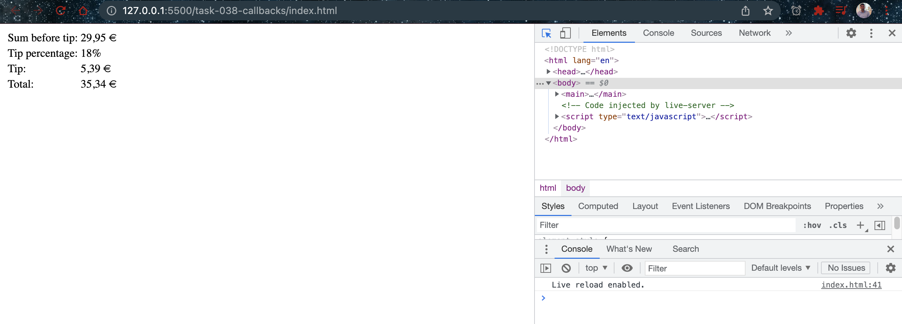

# Callbacks

- [Callback_function](https://developer.mozilla.org/en-US/docs/Glossary/Callback_function)

## Javascript Code

```javascript
// Helper function to format currency numbers. Used by tipCalculator
const formatter = (locale = "en-US", currency = "USD", value) => {
  let formattedValue = new Intl.NumberFormat(locale, {
    style: "currency",
    currency: currency,
  }).format(value);

  return formattedValue;
};

// Callback receives finalTip object, creates and outputs table on the DOM.
const printHTML = (finalTip) => {
  const tipTable = document.createElement("table");
  tipTable.innerHTML = `
    <tr>
      <td>Sum before tip:</td>
      <td>${finalTip.sum}</td>
    </tr>
    <tr>
      <td>Tip percentage:</td>
      <td>${finalTip.percentage}</td>
    </tr>
    <tr>
      <td>Tip:</td>
      <td>${finalTip.tip}</td>
    </tr>
    <tr>
      <td>Total:</td>
      <td>${finalTip.total}</td>
    </tr>
  `;
  document.querySelector("main").append(tipTable);
};

// Create a finalTip object with all the data. Send it to the printHTML callback.
const tipCalculator = (sum, percentage, locale, currency, printHTML) => {
  let tip = sum * (percentage / 100);
  let total = sum + tip;

  const finalTip = {
    sum: formatter(locale, currency, sum),
    percentage: percentage + "%",
    tip: formatter(locale, currency, tip),
    total: formatter(locale, currency, total),
  };

  printHTML(finalTip);
};

tipCalculator(29.95, 18, "de-DE", "EUR", printHTML);
```

## Explaination

In this example, a callback function is used to output a tip calculation as an HTML table on the DOM.

In the code snippet, the concept of a callback function is demonstrated. A callback function is a function that is passed as an argument to another function and is executed inside the function that receives it. In this example, `printHTML` is a callback function that receives a `finalTip` object, which is then used to create an HTML table that displays the tip information.

The `formatter` function is a helper function that formats a currency value and returns a string with the appropriate currency symbol, based on the `locale` and `currency` parameters passed to it.

The `tipCalculator` function is passed the `printHTML` function as an argument. It takes four other arguments: `sum`, `percentage`, `locale`, and `currency`. The `tipCalculator` function calculates the tip and total, formats them using the `formatter` function, and creates the `finalTip` object. This `finalTip` object is then passed to the `printHTML` function as an argument, which uses it to create an HTML table and display it on the webpage.

When the `tipCalculator` function is called with the appropriate arguments, it invokes the `printHTML` function, passing in the `finalTip` object. The `printHTML` function then creates an HTML table that displays the `sum`, `percentage`, `tip`, and `total` values of the `finalTip` object.

The output of the code displays an HTML table that shows the `Sum before tip`, `Tip percentage`, `Tip`, and `Total` values of the tip calculation. The values are formatted using the `formatter` function, with the `locale` and `currency` arguments passed to it.

## Screenshots


