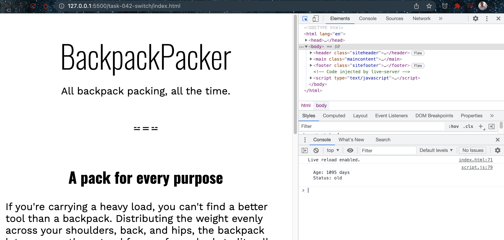

# Switch

- [switch](https://developer.mozilla.org/en-US/docs/Web/JavaScript/Reference/Statements/switch)
  
## Javascript Code

```javascript
const usedStatus = () => {
  let age = everydayPack.backpackAge();
  age = 1095
  let description;
  
  switch (true) {
    case age < 30:
      description = "new"
      break;
    case age >= 30 && age < 365:
      description = "lightly used"
      break;
    case age >= 365 && age < 1095:
      description ="used"
      break;
    case age >= 1095:
      description = "old"
      break;
    default:
      console.log(`There is no description for ${age}.`)
  }

  console.log(`
  Age: ${age} days
  Status: ${description}
  `);
};
```

## Explaination

The provided JavaScript code has been modified to use a `switch` statement to determine the status of the backpack based on its age. Here's an explanation of the updated code:

1. The `usedStatus` function remains the same as before, calculating the backpack's age and initializing the `description` variable.

2. The `age` variable is explicitly set to `1095`, overriding the age obtained from `everydayPack.backpackAge()`.

3. The `switch` statement is used with the expression `true`. This means that the switch will evaluate the conditions provided in each `case` statement directly.

4. The `case` statements compare the `age` value against specific conditions and execute the corresponding block of code if a match is found.

5. In each `case`, the appropriate `description` is assigned based on the age range. For example, if `age` is less than 30, the `description` is set to "new". If `age` is between 30 and 365, it is set to "lightly used", and so on.

6. Each `case` block ends with a `break` statement to exit the `switch` statement once a match is found. This prevents the code from falling through to subsequent `case` blocks.

7. The `default` case is included to handle situations where none of the conditions match. In this case, it logs a message indicating that there is no description for the given age.

8. The final `console.log` statement outputs the `age` and `description` using template literals.

9. The `usedStatus` function is invoked with `usedStatus()`.

When the code is executed, it sets the `age` explicitly to `1095` and uses the `switch` statement to determine the appropriate `description` based on the age ranges. The `age` and `description` are then logged to the console.

## Screenshots

- Switch


