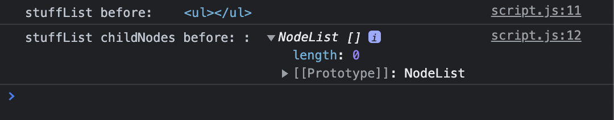
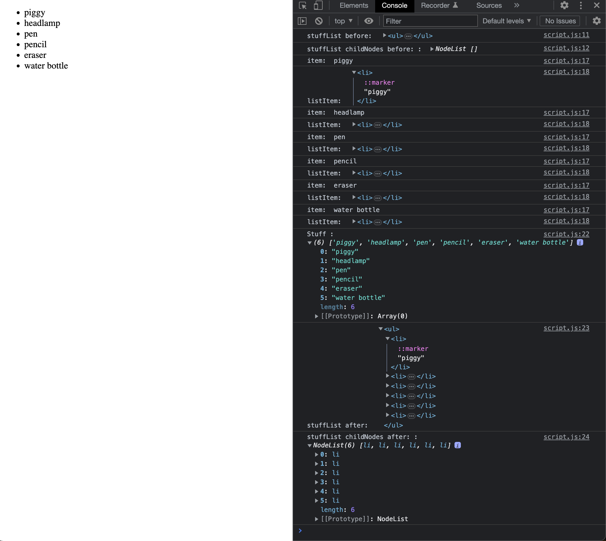

# forEach

## Screenshots

- Before

```javascript
const stuff = ["piggy", "headlamp", "pen", "pencil", "eraser", "water bottle"];

const article = document.querySelector("article");
let stuffList = document.createElement("ul");

console.log("stuffList before: ", stuffList);
console.log("stuffList childNodes before: : ", stuffList.childNodes);
```



- After adding the elements

```javascript
// forEach() array method
stuff.forEach((item) => {
  let listItem = document.createElement("li");
  listItem.innerHTML = item;
  console.log("item: ", item)
  console.log("listItem: ", listItem)
  stuffList.append(listItem);
});

console.log("Stuff : ", stuff)
console.log("stuffList after: ", stuffList);
console.log("stuffList childNodes after: : ", stuffList.childNodes);
article.append(stuffList)
```


