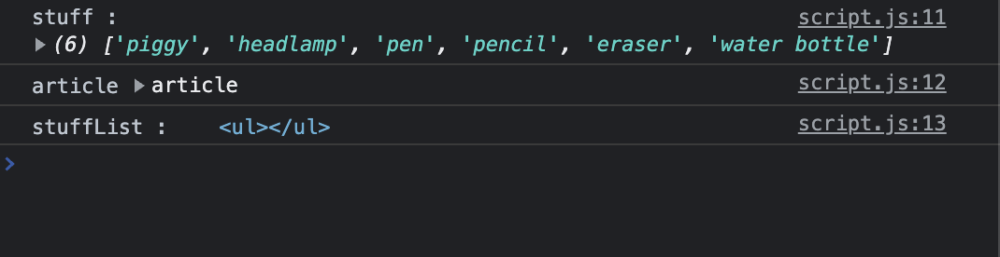
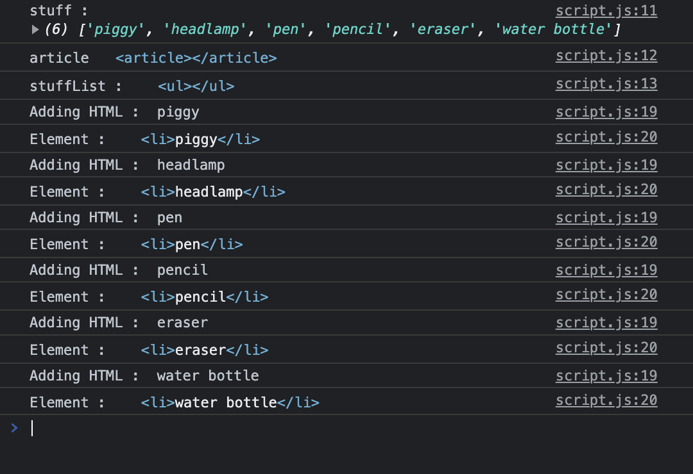
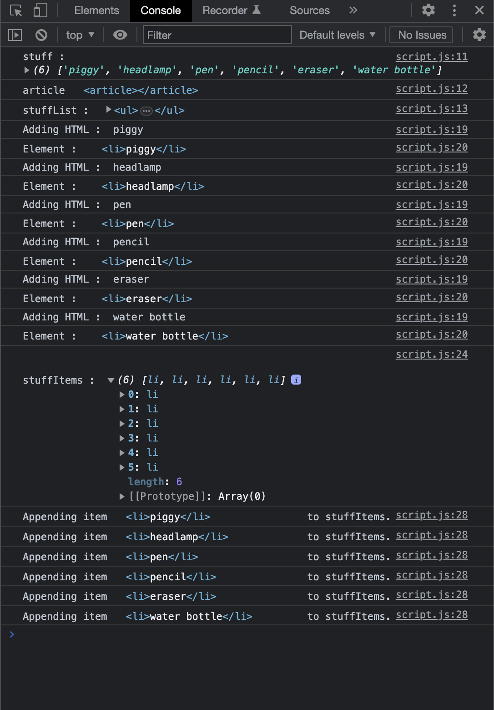
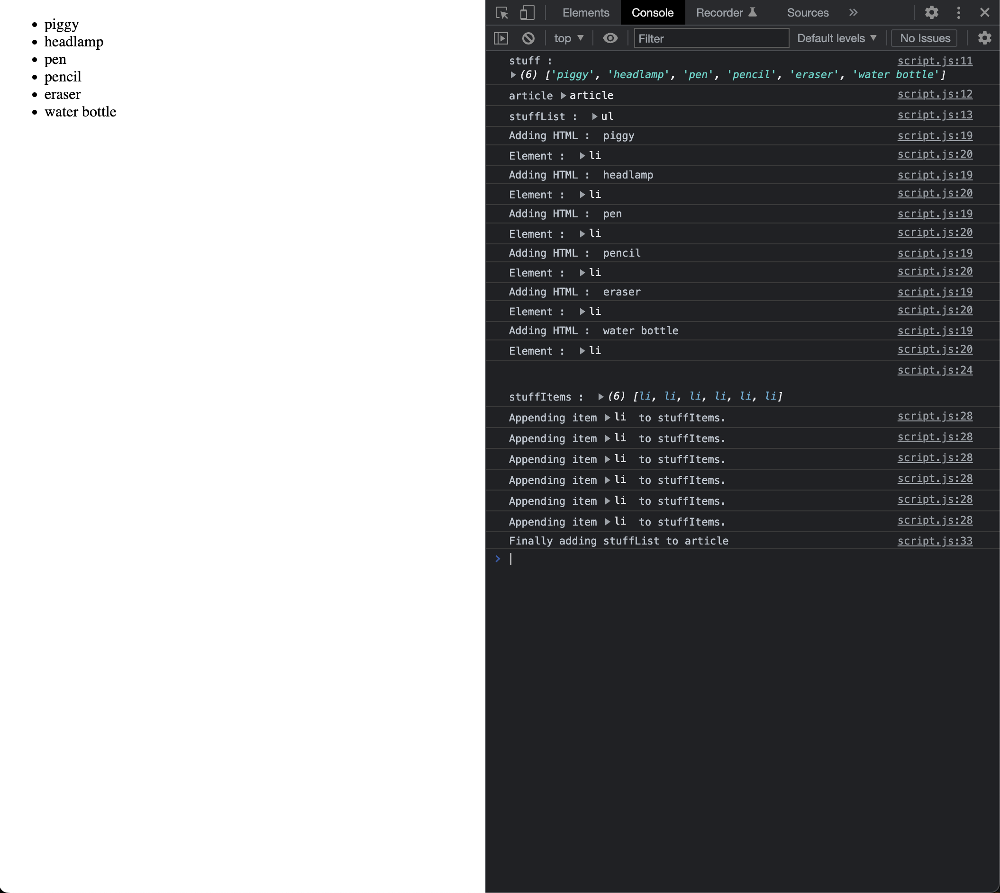

# Map Array

## Screenshots

- Declare elements and print

```javascript
const stuff = ["piggy", "headlamp", "pen", "pencil", "eraser", "water bottle"];

const article = document.querySelector("article");
let stuffList = document.createElement("ul");

console.log("stuff : ", stuff);
console.log("article", article);
console.log("stuffList : ", stuffList);
```



- Adding elements

```javascript
const stuffItems = stuff.map((item) => {
  let listItem = document.createElement("li");
  listItem.innerHTML = item;
  console.log("Adding HTML : ", listItem.innerHTML);
  console.log("Element : ", listItem);
  return listItem;
});
```



- Appending those elements to stuffItems

```javascript
console.log("\n\nstuffItems : ", stuffItems);

// Append each element from the stuffItems array to the stuffList <ul>
stuffItems.forEach((item) => {
  console.log("Appending item", item, " to stuffItems.")
  stuffList.append(item);
});
```



- Adding stuffList to article

```javascript
// Append stuffList to the <article>
console.log("Finally adding stuffList to article");
article.append(stuffList);
```


